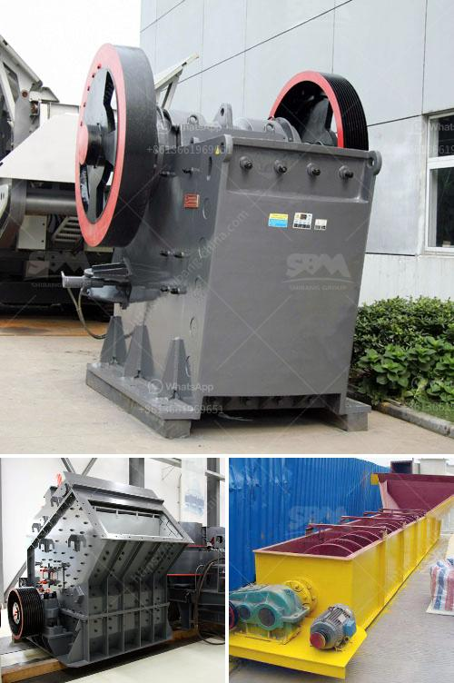

<h3>hydraulic system vertical roller mill</h3>
A hydraulic system plays a crucial role in the functioning of a vertical roller mill. It enables smooth and efficient grinding operations of different materials, all while ensuring high energy efficiency and reliable performance.

The hydraulic system utilizes pressure and flow control loops to accomplish various tasks such as mill table movement, grindability adjustment, grinding pressure control, limestone feed rate control, mill stabilizing, and more. These functions are essential for achieving optimum mill operation and product quality.

One of the primary tasks of the hydraulic system in a vertical roller mill is to regulate the mill table movement. This is accomplished by controlling the hydraulic pressure within the cylinders that actuate the grinding rollers. By adjusting the pressure, the mill table can be raised or lowered, allowing for precise grinding bed thickness control. This ensures the desired surface finish and particle size distribution are obtained.

Additionally, the hydraulic system enables grindability adjustment by controlling the amount of feed material to the mill. By manipulating the hydraulic pressure, the feed rate can be varied, resulting in different material flow rates and grindability levels. This is particularly useful when working with materials of varying hardness or when optimizing the mill performance for specific products.

Grinding pressure control is another crucial aspect of the hydraulic system in a vertical roller mill. It is responsible for maintaining the desired grinding pressure between the grinding rollers and the grinding table. By adjusting the hydraulic pressure, the grinding force can be controlled, ensuring the optimal grinding efficiency and preventing excessive wear on the grinding components.

Controlling the limestone feed rate to the mill is also essential for achieving stable and consistent grinding conditions. The hydraulic system monitors the feed rate and adjusts it accordingly to maintain a constant material flow. This helps to prevent fluctuations in the grinding process, resulting in enhanced quality and uniformity of the final product.

Furthermore, the hydraulic system contributes to mill stabilization by compensating for variations in the material properties or mill operating conditions. It continuously monitors the process parameters and makes real-time adjustments to maintain stable operating conditions. This improves overall mill performance, reduces downtime, and extends the lifespan of critical components.

In conclusion, a hydraulic system is an integral part of a vertical roller mill, enabling smooth and efficient grinding operations. Its functionalities, including mill table movement control, grindability adjustment, grinding pressure control, limestone feed rate control, and mill stabilization, are crucial for achieving high energy efficiency, reliable performance, and superior product quality. As technology continues to advance, hydraulic systems in vertical roller mills will continue to evolve, offering even greater precision and control over the grinding process.
<h3>Contact us</h3><ul><li><strong>Whatsapp:&nbsp;<a href="https://wa.me/8613661969651">+8613661969651</a></strong></li><li><a href="https://swt.shibang-china.com/?git&amp;zhl&amp;hydraulic system vertical roller mill"><strong>Online Service(chat now)</strong></a></li></ul><h3>Related</h3><ul><li><a href='crusher for sale in kerala.md'>crusher for sale in kerala</a></li><li><a href='pulverizing ball mills suppliers.md'>pulverizing ball mills suppliers</a></li><li><a href='to 200 tph pe 750 1060 copper ore jaw crusher.md'>to 200 tph pe 750 1060 copper ore jaw crusher</a></li><li><a href='small scale mining equipment south africa price.md'>small scale mining equipment south africa price</a></li><li><a href='conveyor supplier in the philippines.md'>conveyor supplier in the philippines</a></li></ul>