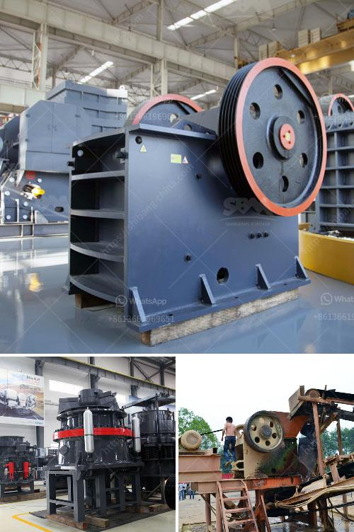

<h3>hydro sizing silica sand crusher plant</h3>
Silica sand is an essential raw material in many industries, including construction, glass manufacturing, and oil and gas extraction. With the growing demand for silica sand, mining and processing operations have expanded rapidly, resulting in the need for effective crushing plants. One efficient solution for this requirement is hydro-sizing, a process that uses water to separate and classify particles based on size.

Hydro-sizing silica sand crusher plants have gained popularity due to their ability to improve efficiency and maximize productivity. Traditional crushing methods, such as jaw crushing, cone crushing, and impact crushing, may cause excessive damage to the silica sand particles. Moreover, these methods often result in a high percentage of fines, reducing the overall quality of the product.

In contrast, hydro-sizing offers a gentler approach. The process involves feeding crushed silica sand into a water-filled tank. The water flow and pressure are adjusted to create a high-speed vortex within the tank. As the sand particles enter the vortex, they experience hydro-cyclonic separation, separating them based on size.

The hydro-sizing process allows for efficient classification of silica sand particles in a wide range of sizes. The larger and heavier particles settle at the bottom of the tank, forming a dense bed, while the smaller and lighter particles are lifted and carried by the water flow. The classified sand can then be collected at different points in the tank, depending on the desired size fraction.

One advantage of hydro-sizing silica sand crusher plants is the reduced energy consumption compared to traditional crushing methods. Crushing equipment, such as jaw crushers, requires significant power to break down the silica sand particles. In contrast, hydro-sizing relies on the force of water flow, requiring less energy to achieve the desired classification.

Furthermore, hydro-sizing offers greater control over the final product. By adjusting the water flow and pressure, operators can fine-tune the separation process, ensuring a consistent and high-quality product. The ability to obtain precise size fractions is particularly beneficial for industries where specific sand particle sizes are required, such as glass manufacturing.

In addition to improving efficiency and product quality, hydro-sizing also offers environmental advantages. The process uses water as the main medium, eliminating the need for harmful chemicals or excessive energy consumption. Additionally, the water used in the hydro-sizing process can be recycled, minimizing water usage and reducing the overall environmental impact of silica sand processing.

Silica sand crusher plants incorporating hydro-sizing offer numerous benefits to operators in terms of efficiency, productivity, and environmental sustainability. By utilizing water-based separation techniques, these plants can achieve better classification of silica sand particles, resulting in higher-quality products. The reduced energy consumption and environmental footprint make hydro-sizing an attractive option for the mining and processing industry.

As demand for silica sand continues to grow, the implementation of hydro-sizing crusher plants holds great potential for maximizing productivity and optimizing the overall silica sand production process. With its ability to enhance efficiency, improve product quality, and reduce environmental impact, hydro-sizing is a technology worth considering for any silica sand processing operation.
<h3>Contact us</h3><ul><li><strong>Whatsapp:&nbsp;<a href="https://wa.me/8613661969651">+8613661969651</a></strong></li><li><a href="https://swt.shibang-china.com/?git&amp;zhl&amp;hydro sizing silica sand crusher plant"><strong>Online Service(chat now)</strong></a></li></ul><h3>Related</h3><ul><li><a href='cement plant cost estimation cement plant cost.md'>cement plant cost estimation cement plant cost</a></li><li><a href='china make vertical roller mill.md'>china make vertical roller mill</a></li><li><a href='screens vibrating screens mobile.md'>screens vibrating screens mobile</a></li><li><a href='stone crusher machine price list in kenya.md'>stone crusher machine price list in kenya</a></li><li><a href='clinker grinding mill germany price.md'>clinker grinding mill germany price</a></li></ul>