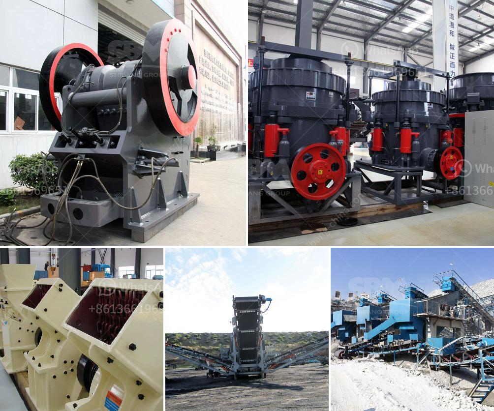

<h3>impact crusher china</h3>
The impact crusher is a versatile machine that can be used in many industries, including mining, quarrying, recycling, and construction. With the increasing demand for aggregate materials in the construction industry, the importance of impact crushers is growing rapidly.

China, as the world's largest producer of aggregates, relies heavily on impact crushers to process materials extracted from quarries. The Chinese impact crusher market has seen rapid development in recent years due to the country's growing construction industry and an urbanization rate that is among the highest in the world.

Impact crushers, also known as hammer crushers, are primarily used to crush rocks and ores for aggregate purposes. They are widely used in mining, metallurgy, chemical, electric power, cement, construction, and other industries. As a result, China's impact crusher market is experiencing a significant increase.

The impact crusher market in China is expected to grow at a CAGR of 6.2% during the forecast period. The rise in urbanization and increasing infrastructure investments in emerging economies like China, India, and Brazil are expected to drive the growth of the impact crushers market.

One of the key players in the Chinese impact crusher market is the Sino-German joint venture, HAZEMAG. Established in 1946, HAZEMAG is a global leader in the design and manufacture of crushing, screening, and sorting equipment. In China alone, HAZEMAG has 14 offices and sales organizations, with more than 50 employees, spread throughout the country. Their impact crushers are produced in their own factories located in Dülmen and Duisburg, Germany.

China's impact crusher market is highly competitive due to the presence of numerous domestic and international market players. Key players such as SBM, Sandvik, and Terex Corporation dominate the market with their robust product portfolios.

The demand for impact crushers is increasing with the rapid pace of development in the construction industry in China. According to the China National Coal Association, the cement industry alone will require nearly 300 million tons of aggregates in the next five years. This highlights the immense potential of the impact crusher market.

The advanced technology used in China's impact crushers has helped the country become a leader in the global mining machinery manufacturing industry. The impact crusher market in China is expected to witness exponential growth in the coming years.

With China's economic growth and the rapid increase in urbanization, there is a huge demand for construction materials, which in turn drives the market for impact crushers. Moreover, the Chinese government's focus on infrastructure development, such as the Belt and Road Initiative, will further boost the demand for impact crushers.

However, the impact crusher market in China faces challenges such as environmental concerns and strict regulations. To address these issues, manufacturers are adopting advanced technologies and producing eco-friendly impact crushers that reduce carbon emissions.

In conclusion, the impact crusher market in China is witnessing tremendous growth due to the rapid expansion of the construction industry. With China's status as the world's largest producer of aggregates, the demand for impact crushers is set to soar. Manufacturers are focusing on technological advancements to produce environment-friendly impact crushers to meet the growing demand. The impact crusher market in China is poised for a game-changing revolution.
<h3>Contact us</h3><ul><li><strong>Whatsapp:&nbsp;<a href="https://wa.me/8613661969651">+8613661969651</a></strong></li><li><a href="https://swt.shibang-china.com/?git&amp;zhl&amp;impact crusher china"><strong>Online Service(chat now)</strong></a></li></ul><h3>Related</h3><ul><li><a href='coal handling coal transfer by conveyors coal crusher.md'>coal handling coal transfer by conveyors coal crusher</a></li><li><a href='ultra fine grinder advantages.md'>ultra fine grinder advantages</a></li><li><a href='aggregate crusher production equipment.md'>aggregate crusher production equipment</a></li><li><a href='quarries rock crushing process.md'>quarries rock crushing process</a></li><li><a href='calculate grinding ball diameter for ball mill.md'>calculate grinding ball diameter for ball mill</a></li></ul>