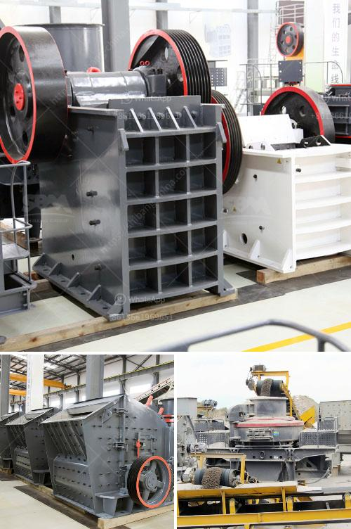

<h3>impact crusher for sale in kenya</h3>
Many times, customers in Kenya are interested in an impact crusher for sale, whether for limestone, granite, or other stone types. But there are only a few companies in Kenya that offer this kind of service. Luckily, there is one company that can help. Introducing, the Impact Crusher for Sale in Kenya, a company that understands the market and its customers' needs.

Impact crushers are widely used in industries such as quarrying, mining, recycling, and construction. These machines are designed to reduce large rocks into smaller rocks, gravel, or rock dust. The impact crusher utilizes a rotor, which rotates at high speeds, to throw the stone against the hard surface of the crushing chamber, thereby breaking it into smaller pieces.

One of the many advantages of an impact crusher is its high reduction ratio. This means that the machine can produce a significant amount of cubical-shaped particles, which are highly sought after in the construction industry. The cubical shape ensures that the aggregate particles interlock well with each other, resulting in strong and durable concrete.

Furthermore, the impact crusher for sale in Kenya is designed to produce a consistent and uniform end product. Unlike other types of crushers, such as jaw crushers, which tend to produce excessive fines, the impact crusher produces a well-graded product without the need for additional screening or classification.

In addition to a high reduction ratio and a consistent end product, the impact crusher also offers exceptional wear resistance. The machines are engineered to withstand the most abrasive materials, ensuring long-lasting performance even in the toughest operating conditions.

When it comes to maintenance, the impact crusher for sale in Kenya is designed with simplicity in mind. The machine's components are easily accessible, making routine maintenance and repairs a hassle-free process. Additionally, the machine's hydraulic systems and other features further enhance its ease of use and maintainability.

As for availability, the impact crusher for sale in Kenya is readily available from reputable dealers. These dealers provide top-quality machines that meet international standards and are backed by warranties and after-sales services.

In conclusion, the impact crusher for sale in Kenya is an excellent piece of equipment for the construction industry. It offers high reduction ratios, consistent end products, exceptional wear resistance, and ease of maintenance. With its reliable performance and availability, the impact crusher is a worthwhile investment for any company or individual in Kenya looking to enhance their material processing capabilities. So, why wait? Contact your local dealer today and inquire about the impact crusher for sale in Kenya.
<h3>Contact us</h3><ul><li><strong>Whatsapp:&nbsp;<a href="https://wa.me/8613661969651">+8613661969651</a></strong></li><li><a href="https://swt.shibang-china.com/?git&amp;zhl&amp;impact crusher for sale in kenya"><strong>Online Service(chat now)</strong></a></li></ul><h3>Related</h3><ul><li><a href='stone crusher zone in nepal.md'>stone crusher zone in nepal</a></li><li><a href='quarry ccrusher equipment price.md'>quarry ccrusher equipment price</a></li><li><a href='hammer mill supplers in bulawayo.md'>hammer mill supplers in bulawayo</a></li><li><a href='cost of cement plant.md'>cost of cement plant</a></li><li><a href='micro grinding machine.md'>micro grinding machine</a></li></ul>