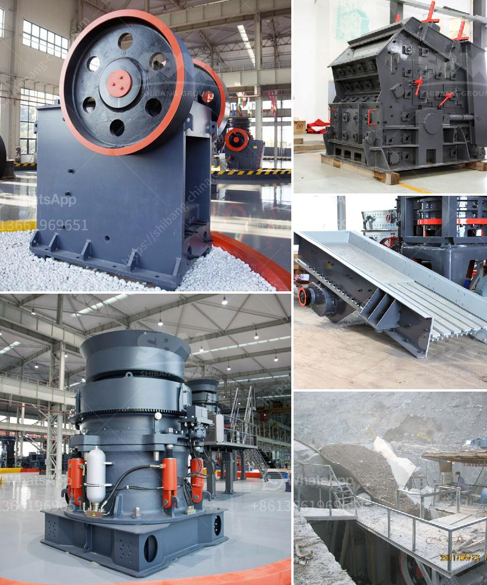

<h3>impact crusher machine price</h3>
The impact crusher machine is a highly efficient and versatile crushing machine that is capable of processing a wide range of materials. This machine is widely used in various industries such as mining, construction, cement, highways, etc. In comparison to the traditional crushing machines, the impact crusher machine has a lower price due to its lower production cost. However, there are several factors that can influence the price of the impact crusher machine.

Firstly, the brand reputation plays a crucial role in determining the price of the impact crusher machine. Well-known brands with excellent product quality and customer service tend to have higher prices. This is because these brands have invested heavily in research and development to produce machines that are more efficient and durable. Such machines come with a higher price tag, but they provide better performance and a longer lifespan.

Secondly, the production capacity of the impact crusher machine can also affect its price. Machines with higher production capacities are usually more expensive than those with lower capacities. Additionally, machines with advanced technologies and features such as automated control systems or adjustable settings also come with higher price tags.

Thirdly, the type and quality of materials used in manufacturing the impact crusher machine can determine its price. Machines made with high-quality materials and components might be pricier, but they offer better performance and durability. On the other hand, lower-quality materials can lead to a lower priced machine, but it might have a shorter lifespan and require more frequent maintenance and repairs.

Lastly, the market demand and competition can influence the price of the impact crusher machine. If there is a high demand for these machines and limited supply, manufacturers might increase the price to maximize their profits. Conversely, if the market is saturated with a variety of options, manufacturers may lower their prices to attract customers and secure sales.

In conclusion, the price of the impact crusher machine can vary based on various factors such as brand reputation, production capacity, materials used, and market demand. It is essential for buyers to consider their specific requirements and budget while choosing an impact crusher machine. Investing in a high-quality and efficient machine can result in long-term cost savings and improved productivity.
<h3>Contact us</h3><ul><li><strong>Whatsapp:&nbsp;<a href="https://wa.me/8613661969651">+8613661969651</a></strong></li><li><a href="https://swt.shibang-china.com/?git&amp;zhl&amp;impact crusher machine price"><strong>Online Service(chat now)</strong></a></li></ul><h3>Related</h3><ul><li><a href='dry process for gold recovery.md'>dry process for gold recovery</a></li><li><a href='gold mining equipment plant for sales.md'>gold mining equipment plant for sales</a></li><li><a href='screen astec vibrating screen price.md'>screen astec vibrating screen price</a></li><li><a href='india dolomite grinding machine.md'>india dolomite grinding machine</a></li><li><a href='portable crushing and screening plant.md'>portable crushing and screening plant</a></li></ul>