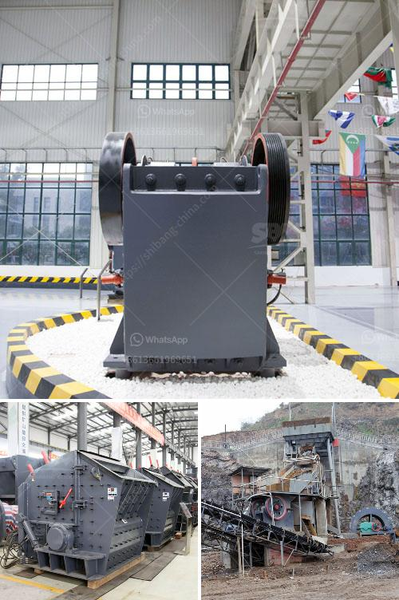

<h3>impact crusher mesh</h3>
An impact crusher is a machine used to break down large rocks into smaller pieces. These machines are designed to crush materials with a maximum particle size of less than 500mm and compression strength of up to 350MPa. With the advancement in technology, impact crushers have become more efficient, allowing for greater productivity and reduced downtime. One of the key components that contribute to this efficiency is the impact crusher mesh.

The impact crusher mesh refers to the screen size of the discharge material. This mesh plays a crucial role in controlling the final product size, ensuring it meets the desired specification. Different mesh sizes can be used to produce various sizes of finished products. By selecting the appropriate mesh, operators can achieve the desired particle size distribution, resulting in better product quality.

Furthermore, the impact crusher mesh also plays a vital role in ensuring the smooth flow of material through the crusher. When the mesh is too fine, it can cause clogging and hinder the efficient operation of the crusher. On the other hand, if the mesh is too large, it may allow oversized material to pass through, leading to excessive wear and tear on the machine.

In order to maximize the efficiency of an impact crusher, it is crucial to select the appropriate mesh size based on the specific application and desired product specifications. Impact crusher manufacturers typically provide guidelines and recommendations on the ideal mesh sizes for different types of materials. However, it is important for operators to understand their specific requirements and make adjustments accordingly.

To determine the optimal mesh size, factors such as the particle size distribution of the feed material, desired product size, and the type of material being processed should be taken into consideration. For instance, for a limestone crushing operation, a mesh size of 10 to 30mm may be suitable, while for a coal crushing operation, a finer mesh size of 6 to 10mm may be required.

In addition to selecting the appropriate mesh size, regular maintenance and inspection of the impact crusher mesh are crucial for optimal performance. Over time, the mesh may become worn out or damaged, leading to reduced efficiency and poor product quality. It is important to check the mesh regularly and replace it when necessary to ensure consistent and efficient operation.

In conclusion, the impact crusher mesh is an important component that directly impacts the efficiency and productivity of the crushing operation. By selecting the appropriate mesh size and properly maintaining it, operators can achieve the desired product size distribution, enhance the quality of the finished product, and optimize the performance of the impact crusher. It is crucial for operators to understand the specific requirements of their application and make informed decisions when it comes to the impact crusher mesh.
<h3>Contact us</h3><ul><li><strong>Whatsapp:&nbsp;<a href="https://wa.me/8613661969651">+8613661969651</a></strong></li><li><a href="https://swt.shibang-china.com/?git&amp;zhl&amp;impact crusher mesh"><strong>Online Service(chat now)</strong></a></li></ul><h3>Related</h3><ul><li><a href='hydraulic stone crusher for hire uk.md'>hydraulic stone crusher for hire uk</a></li><li><a href='crusher price south africa.md'>crusher price south africa</a></li><li><a href='jaw crushers from saudi.md'>jaw crushers from saudi</a></li><li><a href='coal crusher machine capacity of 5 tons an hour.md'>coal crusher machine capacity of 5 tons an hour</a></li><li><a href='ball mill work rules.md'>ball mill work rules</a></li></ul>