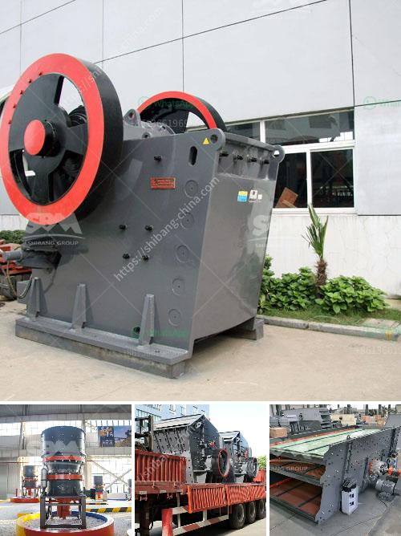

<h3>impact crushers saudi</h3>
Impact crushers have gained immense popularity in recent years, especially in Saudi Arabia. These machines are widely used in various construction projects across the country. The increasing demand for these crushers is driven by the growth of the construction industry and the need for efficient and reliable equipment.

An impact crusher is a type of heavy machinery that utilizes impact force to crush materials. When the material enters the crushing chamber, it is subjected to a high-speed impact from the blow bar. These impacts cause the material to break into smaller pieces, which are then discharged through the side or bottom of the machine.

One of the key advantages of impact crushers is their versatility. They can be used to crush a wide range of materials, including limestone, concrete, and asphalt. This makes them suitable for a variety of applications, such as road construction, building demolition, and aggregate production. Additionally, impact crushers have a high reduction ratio, which means that they can produce smaller particles with fewer stages of crushing.

In Saudi Arabia, impact crushers are used to crush materials for concrete, road construction, and building demolition projects. The demand for these machines is fueled by the rapid urbanization and development happening in the country. As more cities are being built and existing infrastructure is being upgraded, the need for efficient crushers becomes indispensable.

Moreover, impact crushers offer several benefits in terms of operational efficiency and cost-effectiveness. These machines are equipped with advanced features that make them easy to operate and maintain. Additionally, they have a lower initial investment cost compared to other crushers, which makes them an attractive option for contractors and construction companies.

Overall, impact crushers have made a significant impact in the construction industry in Saudi Arabia. Their ability to crush a wide range of materials and their operational efficiency have made them an essential piece of equipment for construction projects across the country. As Saudi Arabia continues to witness rapid development, the demand for impact crushers is expected to grow further in the coming years.
<h3>Contact us</h3><ul><li><strong>Whatsapp:&nbsp;<a href="https://wa.me/8613661969651">+8613661969651</a></strong></li><li><a href="https://swt.shibang-china.com/?git&amp;zhl&amp;impact crushers saudi"><strong>Online Service(chat now)</strong></a></li></ul><h3>Related</h3><ul><li><a href='kaolin crusher processing machine.md'>kaolin crusher processing machine</a></li><li><a href='vibrating screen efficiency.md'>vibrating screen efficiency</a></li><li><a href='quartz manufacturing plant in india.md'>quartz manufacturing plant in india</a></li><li><a href='coal fine pelletizing machine manufacturer india.md'>coal fine pelletizing machine manufacturer india</a></li><li><a href='ball mill grinders cost.md'>ball mill grinders cost</a></li></ul>