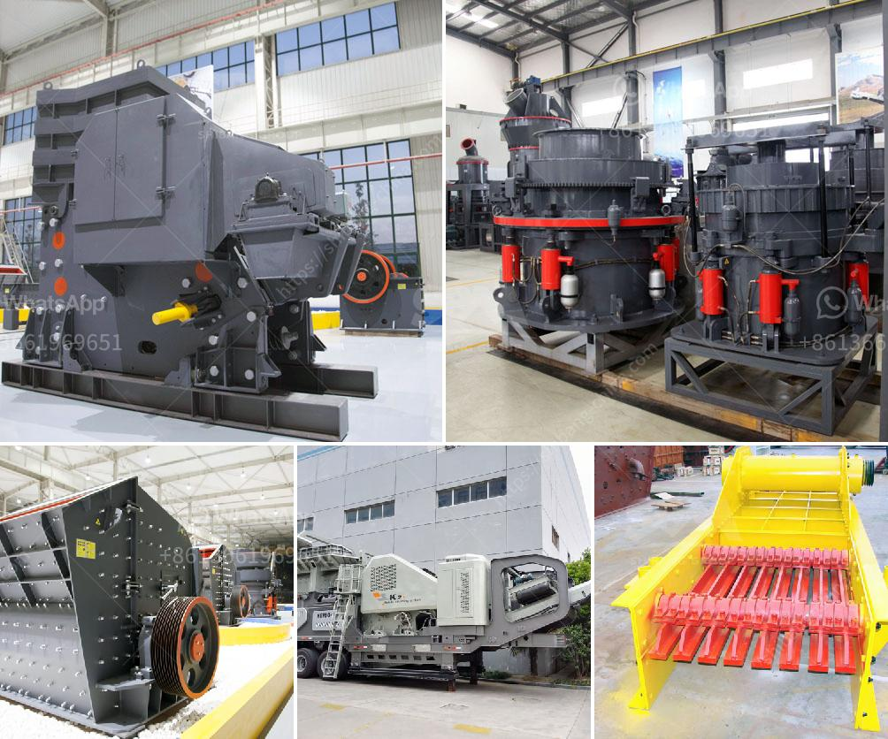

<h3>india dolomite grinding machine</h3>
India Dolomite Grinding Machine made by Shanghai Clirik has the features of high efficiency, environmental protection, and energy consumption. The powder are widely used as new building materials and chemical products of raw materials because of rich resource and low price, getting the favor people. At present ,our ultrafine mill ;ultrafine grinder;ultrafine grinding mill not only has a large number of customers at home , but also exported to dozens of countries abroad.

the growing demand for fine powder from these industries has also led to the increase in the use of dolomite grinding machines, which are known for their cost-effectiveness and high grinding efficiency.

Dolomite grinding machines serve numerous purposes in the construction industry. As the number of buildings increases, the use of dolomite powder also increases. Similarly, dolomite powder is widely used in building materials, chemical industry, glass, ceramics, refractory materials, agriculture, environmental protection, energy saving and other fields. It is an essential raw material for many industries. 

In recent years, the Indian dolomite powder grinding market has gradually increased. The requirements for the fineness of the powder range from 200 mesh to 325 mesh, and the requirements for the equipment are also different. To this end, India Dolomite Grinding Machine Manufacturers have specially developed a different approach to the market, mainly formulated according to the hardness, fineness and productivity of different materials. 

The main principle of dolomite grinding machine is that the grinding roller is rolled tightly on the grinding ring under the action of centrifugal force. The shovel scoops the material to the middle of the grinding roller and the grinding ring. The material is broken into powder between the grinding rollers and the grinding rings, and then brought into the analytical machine by the draught fan for sorting and screening. The fine powder conforms to the airflow and enters the cyclone collector through the pipeline for separation and collection. The powder collected is the final product. 

Compared with other mills, the dolomite grinding machine manufactured by Shanghai Clirik Machinery Co., Ltd. has the highest pulverizing efficiency, the minimum pulverizing power consumption, and the highest output. Its output per hour is twice that of other mills with the same power consumption, and the energy consumption per unit product is also lower. The whole set of dolomite grinding equipment mainly consists of main machines, feeders, classifiers, cyclone collectors, pulse dust collectors and high-pressure fans.

The high-pressure air blower constantly inhales air within the grinding mill and, in turn, the airflow with crushed materials are brought to the classifier whose high-speed impeller will screen the airflow: the unqualified particle size will fall and return to the mill for being reground while the qualified particle size mixed with air will go into the cyclone powder collector. Most of the qualified powders will fall an exit from the discharging valve at the bottom; a small proportion of the fine powders, with airflow, moves to the dust cleaner, and will be cleaned by the dust remover, and discharged through the discharge valve as the final product.

In conclusion, the India Dolomite Grinding Machine has a high degree of automation, grinding fineness is smaller, and the grinding operation is very simple, so as to ensure the competitiveness of its products. In addition, the grinding mill has excellent drying function, can be used for drying of dolomite, and suitable for other industries.
<h3>Contact us</h3><ul><li><strong>Whatsapp:&nbsp;<a href="https://wa.me/8613661969651">+8613661969651</a></strong></li><li><a href="https://swt.shibang-china.com/?git&amp;zhl&amp;india dolomite grinding machine"><strong>Online Service(chat now)</strong></a></li></ul><h3>Related</h3><ul><li><a href='plamnta mobile stone crusher.md'>plamnta mobile stone crusher</a></li><li><a href='jaw crusher production line diagram.md'>jaw crusher production line diagram</a></li><li><a href='ultra fine powder grinding machine.md'>ultra fine powder grinding machine</a></li><li><a href='chrome crushing plant.md'>chrome crushing plant</a></li><li><a href='new generation of hammer mill.md'>new generation of hammer mill</a></li></ul>