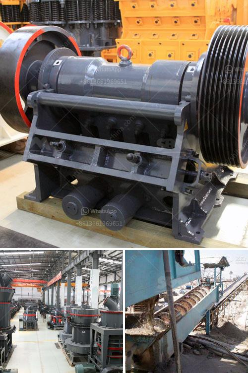

<h3>indonesia vertical grinding machine</h3>
Indonesia, renowned for its rich natural resources and rapidly growing industrial sector, has been at the forefront of technological innovation in recent years. The country has made significant progress in various sectors, including manufacturing. One such groundbreaking development is the introduction of vertical grinding machines, which have revolutionized the metalworking industry. This article delves into the advancements achieved in Indonesia's vertical grinding machine, highlighting its significance, benefits, and impact on the country's industrial landscape.

Vertical grinding machines are a novel addition to Indonesia's manufacturing capabilities, providing manufacturers with enhanced precision, efficiency, and cost-effectiveness. These machines are primarily used for grinding and milling operations and offer distinct advantages over traditional horizontal grinding machines.

1. Enhanced Precision: One of the most significant advantages of vertical grinding machines is their ability to provide precise grinding and milling results. With advanced technologies and computer numerical control (CNC) capabilities, these machines can achieve superior accuracy and consistency in shaping and leveling metal surfaces. This enhanced precision ensures high-quality finished products and reduces the need for additional processing steps.

2. Improved Efficiency: Vertical grinding machines are designed to maximize efficiency in the manufacturing process. By utilizing a vertically oriented spindle, manufacturers can increase the grinding wheel's contact with the workpiece, resulting in faster material removal rates. This enhanced efficiency reduces production time, increases throughput, and optimizes resource utilization.

3. Versatility: Indonesia's vertical grinding machines have the advantage of being highly versatile. They can handle a wide range of materials, including metals, ceramics, and composite materials. This versatility makes them suitable for various applications, from metal fabrication and aerospace manufacturing to automotive and renewable energy industries.

The introduction of vertical grinding machines has had a profound impact on Indonesia's industrial landscape. It has provided local manufacturers with access to cutting-edge technology, enabling them to produce higher-quality products competitively. This not only strengthens Indonesia's manufacturing sector but also positions the country as a key player in the global market.

Furthermore, the adoption of vertical grinding machines contributes to the overall economic growth of the nation. As manufacturers increase their production capabilities and deliver superior-quality products, they attract domestic and international clients, leading to increased investments, job creation, and economic prosperity.

Indonesia's vertical grinding machine has paved the way for significant advancements in the country's manufacturing sector. Offering enhanced precision, improved efficiency, and versatility, these machines have transformed the metalworking industry by enabling manufacturers to produce high-quality products at a competitive cost. Moreover, this technological innovation has bolstered the nation's industrial landscape, positioning Indonesia as a global player in manufacturing. As the country continues to invest in cutting-edge technologies, it is poised to achieve further growth and contribute to the overall development of the global manufacturing industry.
<h3>Contact us</h3><ul><li><strong>Whatsapp:&nbsp;<a href="https://wa.me/8613661969651">+8613661969651</a></strong></li><li><a href="https://swt.shibang-china.com/?git&amp;zhl&amp;indonesia vertical grinding machine"><strong>Online Service(chat now)</strong></a></li></ul><h3>Related</h3><ul><li><a href='track mobile crusher.md'>track mobile crusher</a></li><li><a href='ball mill for cement.md'>ball mill for cement</a></li><li><a href='crushing machine in ghana.md'>crushing machine in ghana</a></li><li><a href='price of a set of stone crushing machine.md'>price of a set of stone crushing machine</a></li><li><a href='crusher plant saudi.md'>crusher plant saudi</a></li></ul>