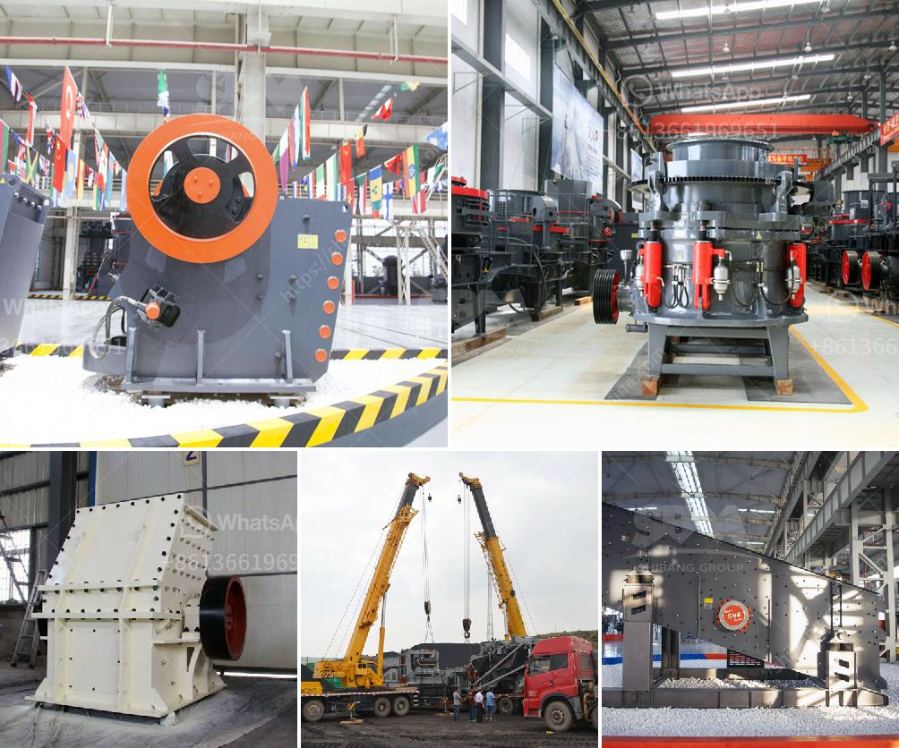

<h3>industrial limestone impact crushers</h3>
Industrial limestone impact crushers are designed for medium and large-scale industries operating in the quarrying, mining, and recycling sectors. These crushers offer users higher capacity, better product shape, and a wide range of applications in the construction, mining, and cement industries.

Impact crushers are commonly used to crush limestone, coal, calcium carbide, quartz, dolomite, iron pyrites, gypsum, and chemical raw materials of medium hardness. With a compressive strength of up to 350MPa, these crushers are more suitable for materials such as limestone, shale, calcium carbide, carbide slag, bluestone, basalt, and other mineral wastes.

One of the key benefits of industrial limestone impact crushers is their excellent versatility. They can be used in a variety of applications, including primary, secondary, and tertiary crushing of a wide range of materials. This makes them perfect for use in the construction industry as well as the mining and quarrying sectors.

The impact crushers operate by impact rather than compression, which leads to a higher reduction ratio and more efficient energy utilization. The main components of an industrial impact crusher are a rotor, hammer bars, impact plates, and liners. The material is crushed under the impact force from the high-speed rotating hammers and then thrown onto the impact plates for a secondary crushing process. The crushed material is further crushed by the impact forces from the impact plates before being discharged from the crusher.

One of the primary advantages of industrial limestone impact crushers is their low maintenance requirement. These crushers are designed to accommodate a wide range of wear parts, which are easily replaceable. This reduces maintenance effort and downtime, ensuring a continuous and efficient operation.

Additionally, industrial limestone impact crushers are equipped with advanced safety features to prevent accidents and protect the operator. These features include a hydraulic opening mechanism for easy access to the rotor and impact plates, a rotor locking device for safer maintenance, and an automatic lubrication system to ensure smooth operation.

In terms of environmental impact, industrial limestone impact crushers are designed to minimize pollution caused by dust, noise, and vibration. The crushers are equipped with enclosed or semi-enclosed magnetic vibrating feeders, which are designed to prevent dust emission and reduce noise levels. Additionally, the crushers are often equipped with a water spraying system to further reduce dust emissions.

In conclusion, industrial limestone impact crushers are an excellent choice for the production of high-quality limestone aggregates. These crushers offer users higher capacity, better product shape, and reduced maintenance requirements. With their versatility, they can be used in various applications in the construction, mining, and recycling sectors. Furthermore, their advanced safety features and environmental-friendly design make them a reliable and sustainable choice for industries operating in the quarrying, mining, and recycling sectors.
<h3>Contact us</h3><ul><li><strong>Whatsapp:&nbsp;<a href="https://wa.me/8613661969651">+8613661969651</a></strong></li><li><a href="https://swt.shibang-china.com/?git&amp;zhl&amp;industrial limestone impact crushers"><strong>Online Service(chat now)</strong></a></li></ul><h3>Related</h3><ul><li><a href='roller mill sahibabad.md'>roller mill sahibabad</a></li><li><a href='used crusher for sale sell buy.md'>used crusher for sale sell buy</a></li><li><a href='small gold ore crusher grinder.md'>small gold ore crusher grinder</a></li><li><a href='price of stone crushers in malaysia.md'>price of stone crushers in malaysia</a></li><li><a href='crusher machine philippines.md'>crusher machine philippines</a></li></ul>