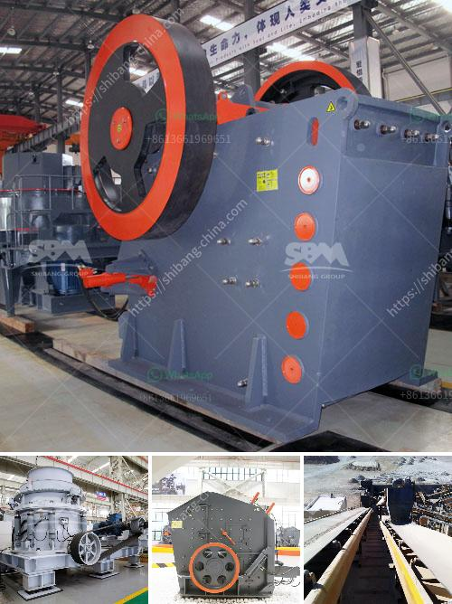

<h3>industrial mill and prices</h3>
Industrial mills play a critical role in various manufacturing processes. From crushing and grinding materials to reducing particle sizes, they are essential equipment across industries such as mining, construction, and chemical production. The prices of these machines are influenced by a multitude of factors, ranging from their size and capacity to the level of automation they offer. In this article, we will explore the different types of industrial mills and shed light on the pricing dynamics associated with them.

When it comes to industrial mills, one of the key factors that determines their prices is the type of mill itself. There are several categories, including ball mills, rod mills, hammer mills, and roller mills. Each type has its specific applications and features, which directly impact their costs. 

Starting with ball mills, these are highly efficient machines for grinding and blending materials. They consist of a rotating drum filled with grinding media, such as steel balls or ceramic pebbles. Ball mills are commonly used in mineral processing, cement production, and pharmaceutical industries, among others. Due to their versatility and wide-ranging applications, prices for ball mills vary significantly based on factors like size, capacity, and materials used in construction.

Rod mills, on the other hand, are mainly used for grinding materials that are too wet for fine crushing and dry screening. These mills employ long rods instead of balls as the grinding medium. The main advantage of rod mills is their ability to produce a more uniform product size, especially in coarser applications. The price of rod mills depends on factors such as capacity, length, and diameter of the mill.

Hammer mills are widely used in various industries for size reduction of materials. They consist of rotating hammers mounted on a high-speed rotor. The hammers impact the materials, reducing their sizes and producing a wide range of particle sizes. Hammer mills are known for their ability to process a variety of materials, including grains, wood, and biomass. Their prices vary according to factors like motor power, size, and the type of material being processed.

Lastly, roller mills are commonly used in the agricultural and food processing industries. These machines consist of rollers that crush and grind solid materials such as grains, seeds, and spices. The main advantage of roller mills is their ability to produce a more uniform and finer product compared to other types of mills. Prices for roller mills depend on factors like roller diameter, roller length, and the capacity of the machine.

In addition to the type of mill, several other factors influence the prices of these industrial machines. Size and capacity are two crucial parameters that significantly impact the cost. Larger mills with higher capacities can handle larger volumes of materials, resulting in higher prices. Moreover, the level of automation and control systems incorporated into the mill also influence the cost. More advanced features, such as digital interfaces, variable speed control, and automatic feeding mechanisms, contribute to higher prices.

It is worth noting that prices for industrial mills can range from a few thousand dollars for smaller, basic models to several hundred thousand dollars or more for larger, advanced versions. Additionally, geographical location, market demand, and the reputation of the manufacturer may also affect the pricing of industrial mills.

In conclusion, the pricing of industrial mills is influenced by several factors, including the type of mill, size, capacity, level of automation, and other features. Whether it's a ball mill, rod mill, hammer mill, or roller mill, understanding the unique applications and factors influencing their prices is essential for both buyers and manufacturers in making informed decisions.
<h3>Contact us</h3><ul><li><strong>Whatsapp:&nbsp;<a href="https://wa.me/8613661969651">+8613661969651</a></strong></li><li><a href="https://swt.shibang-china.com/?git&amp;zhl&amp;industrial mill and prices"><strong>Online Service(chat now)</strong></a></li></ul><h3>Related</h3><ul><li><a href='calculating capacity of a roll crusher.md'>calculating capacity of a roll crusher</a></li><li><a href='different crushed stones in nigeria.md'>different crushed stones in nigeria</a></li><li><a href='quartz manufacturing plant in india.md'>quartz manufacturing plant in india</a></li><li><a href='pine cone coal manufacturing machinery.md'>pine cone coal manufacturing machinery</a></li><li><a href='quarrying crusher machines.md'>quarrying crusher machines</a></li></ul>