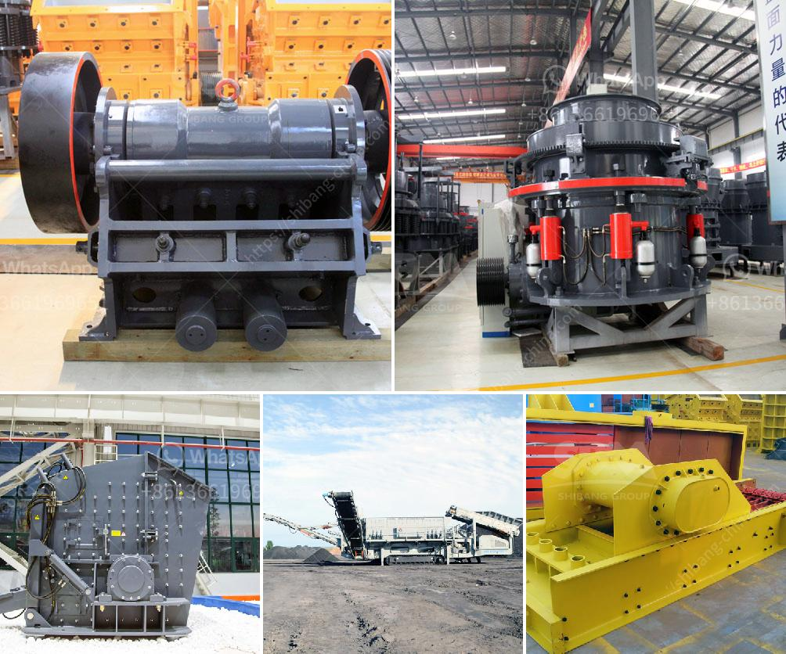

<h3>industrial mills in mexico</h3>
Mexico, a country renowned for its rich history and vibrant culture, is also making significant strides in its industrial sector. One indispensable component of this sector is the presence of industrial mills, which play a pivotal role in the country's economic growth. These mills, with their diverse applications and steady innovation, contribute immensely to Mexico's industrial development.

The industrial mills in Mexico are multifaceted establishments that range from paper mills to textile mills and more. These facilities, scattered across various regions, serve as the backbone of many industries by providing the raw materials needed for various manufacturing processes. For instance, paper mills produce vast quantities of paper, a staple for packaging, printing, and publishing industries. Textile mills, on the other hand, produce fabrics that fuel the fashion and garment industries, both domestically and internationally.

The strategic location of Mexico further enhances its position as an ideal location for industrial mills. Its proximity to both the Pacific Ocean and the Gulf of Mexico offers an advantage for importing raw materials and exporting finished products. Additionally, Mexico's numerous free trade agreements with countries like the United States, Canada, and the European Union provide access to a wide range of markets, enabling industrial mills to thrive.

One notable aspect of industrial mills in Mexico is their commitment to sustainability. Many mills have implemented environmentally friendly initiatives to minimize their carbon footprint. They invest in technologies that efficiently utilize water resources, reduce air pollution, and promote responsible waste management. By prioritizing environmental sustainability, these mills are not only contributing to the country's economic growth but also preserving Mexico's natural resources for future generations.

Furthermore, industrial mills in Mexico serve as catalysts for job creation in the country. They provide employment opportunities for a significant number of the Mexican population, particularly those residing in rural areas. These mills often have extensive supply chains, engaging local communities, and promoting economic development at both regional and national levels.

In recent years, the Mexican government has recognized the importance of industrial mills and has taken steps to create an enabling environment for their growth. Infrastructure investments, reforms in trade policies, and fostering an investor-friendly climate have played a key role in attracting both national and foreign investments to the sector. These measures have resulted in increased productivity, improved efficiency, and expanded production capacity for industrial mills in Mexico.

Mexican industrial mills are not just contributing to the nation's economy but also playing a crucial role in its international trade. Their high-quality products have gained recognition globally, establishing Mexico as a competitive player in the global market. Mexican mills export their products to numerous countries, offering a diverse range of goods that cater to different industries' needs.

In conclusion, the presence of industrial mills in Mexico has emerged as a significant driver of economic growth. These versatile establishments not only supply essential raw materials for various industries but also generate employment opportunities and contribute to Mexico's international trade. With their commitment to sustainability and continuous innovation, industrial mills in Mexico are well-positioned to continue playing a vital role in the country's industrial development, fostering economic prosperity for years to come.
<h3>Contact us</h3><ul><li><strong>Whatsapp:&nbsp;<a href="https://wa.me/8613661969651">+8613661969651</a></strong></li><li><a href="https://swt.shibang-china.com/?git&amp;zhl&amp;industrial mills in mexico"><strong>Online Service(chat now)</strong></a></li></ul><h3>Related</h3><ul><li><a href='jaw crusher supplier in the philippines.md'>jaw crusher supplier in the philippines</a></li><li><a href='concrete crusher for rent qatar.md'>concrete crusher for rent qatar</a></li><li><a href='quartz stone cruher process.md'>quartz stone cruher process</a></li><li><a href='stone crusher nigeria.md'>stone crusher nigeria</a></li><li><a href='jaw crusher crusher china.md'>jaw crusher crusher china</a></li></ul>