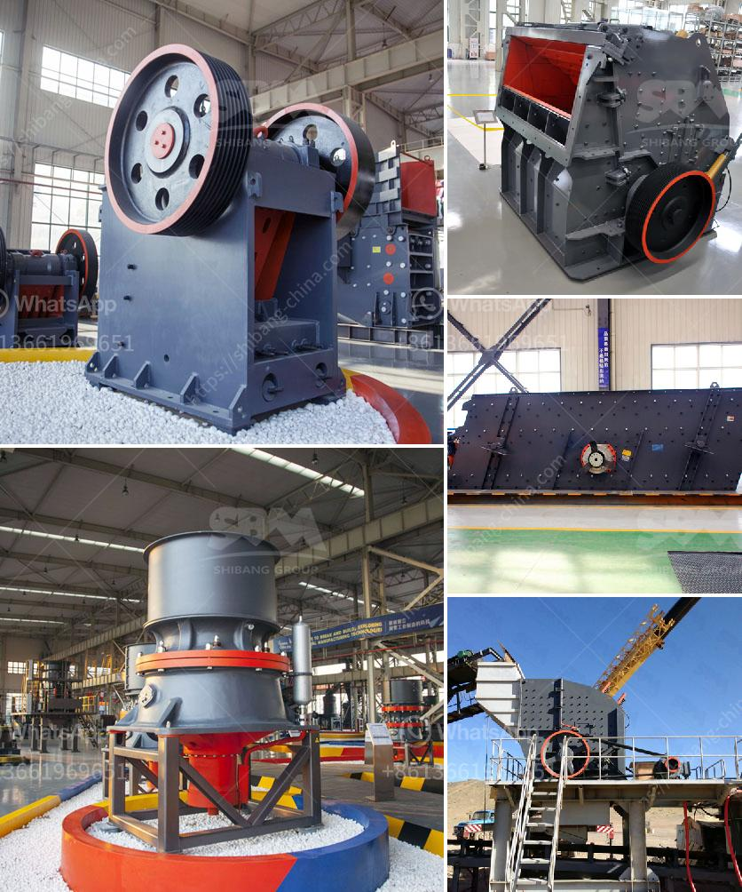

<h3>industrial rock crusher</h3>
Industrial rock crushers are multifunctional machines that are used to break down and reduce the size of materials (such as ore, stone, rock, and concrete) to facilitate their subsequent processing or disposal. These machines are commonly found in mining, construction, and recycling industries, where they are used for crushing a variety of materials into smaller, more manageable pieces.

One of the key features of an industrial rock crusher is its ability to provide optimal crushing efficiency. This is achieved by applying a combination of forces, such as compression, impact, and attrition, to the material being crushed. The crusher's powerful motor and strong flywheel provide the necessary momentum to generate the necessary force needed for crushing. Additionally, the crusher's specially designed jaws or hammers are made from high-strength materials to ensure their durability and longevity.

When choosing an industrial rock crusher, it is important to consider factors such as the crusher's capacity, power usage, size reduction ratio, and the final product size required. Crushers with higher capacities can process more materials in a shorter time, making them ideal for high-production environments. Similarly, crushers with higher power usage can provide more force during the crushing process, ensuring efficient and quick operations. Size reduction ratio refers to the ratio of the size of the initial material to the size of the final product. A higher reduction ratio indicates a more efficient crushing process. Finally, the choice of the final product size depends on the specific requirements of the industry or application. Some industries require a fine, uniform product, while others prefer a coarser, more oversized product.

Industrial rock crushers come in various types, including jaw crushers, cone crushers, impact crushers, and roll crushers. Each type has its own unique features and advantages, depending on the desired outcome. Jaw crushers are primarily used for coarse and medium crushing and are capable of processing materials with a strength of up to 320 megapascals (MPa). Cone crushers, on the other hand, are more suited for secondary and tertiary crushing applications, and can handle materials with a strength of up to 200 MPa. Meanwhile, impact crushers are designed for crushing soft to medium-hard materials and can produce a well-shaped product. Roll crushers are mostly used in smaller scale production settings and are ideal for materials such as coal, gypsum, and limestone.

In summary, industrial rock crushers are powerful machines used in various industries to break down and reduce the size of materials. Whether it is for mining, construction, or recycling, these machines offer efficient crushing capabilities. When choosing a rock crusher, it is important to consider factors such as capacity, power usage, size reduction ratio, and the final product size required. With the right crusher, industries can optimize their operations and enhance their productivity.
<h3>Contact us</h3><ul><li><strong>Whatsapp:&nbsp;<a href="https://wa.me/8613661969651">+8613661969651</a></strong></li><li><a href="https://swt.shibang-china.com/?git&amp;zhl&amp;industrial rock crusher"><strong>Online Service(chat now)</strong></a></li></ul><h3>Related</h3><ul><li><a href='jaw crusher pe.md'>jaw crusher pe</a></li><li><a href='grinding machine its operation principle.md'>grinding machine its operation principle</a></li><li><a href='china make vertical roller mill.md'>china make vertical roller mill</a></li><li><a href='price of stone crushers in malaysia.md'>price of stone crushers in malaysia</a></li><li><a href='process of cement making.md'>process of cement making</a></li></ul>