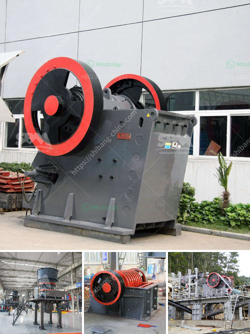

<h3>iron crushing equipment cost</h3>
The mining industry is known for its high-risk operations, requiring heavy machinery and robust equipment to extract valuable minerals and resources from the earth. One of the key components in this process is iron crushing equipment, essential for breaking down iron ore into smaller pieces for further processing and refinement.

Iron crushing equipment is designed to handle the demanding nature of mining operations, where iron ore rocks are broken down into smaller and more manageable sizes. These pieces are then transported to mills or other processing facilities for further refinement and extraction. It is crucial to invest in reliable and efficient iron crushing equipment to ensure continuous operation and optimal productivity.

One of the primary considerations when investing in iron crushing equipment is cost. Like any business decision, it is essential to evaluate the cost implications and potential return on investment. The cost of iron crushing equipment can vary depending on several factors, including the type of equipment, its capacity, and its features and specifications. However, the long-term benefits and advantages can far outweigh the initial investment cost.

Efficiency and productivity are vital factors in the mining industry, as they directly impact profitability. By investing in high-quality iron crushing equipment, mining companies can benefit from improved efficiency, reduced downtime, and increased productivity. Modern equipment is designed to maximize production rates and minimize maintenance and operational costs.

Moreover, reliable iron crushing equipment helps minimize production delays caused by equipment breakdowns or failures. This ensures a consistent supply of iron ore to processing plants and prevents interruption in the production cycle. By avoiding downtime, mining operations can optimize their output, meet customer demands, and increase profitability.

Another crucial consideration regarding the cost of iron crushing equipment is operational and maintenance expenses. As mining operations involve harsh and challenging environments, it is necessary to invest in durable and robust equipment that can withstand these conditions. High-quality equipment can minimize maintenance costs, spare parts replacement, and repairs, reducing the overall cost of operation.

Furthermore, modern iron crushing equipment incorporates advanced technology and automation, further enhancing productivity and reducing costs. Automation allows for better control and precision, minimizing human error and optimizing efficiency. This results in cost savings, as fewer resources are required for operation and maintenance.

In conclusion, iron crushing equipment is an essential investment for the mining industry. Though the initial cost may be significant, the long-term benefits far outweigh the investment. By investing in reliable and efficient equipment, mining companies can enhance productivity, minimize downtime, reduce operational and maintenance costs, and ultimately increase profitability. Additionally, with advancements in technology and automation, iron crushing equipment offers even more cost-saving advantages. As the demand for iron ore continues to grow, investing in high-quality crushing equipment becomes even more paramount.
<h3>Contact us</h3><ul><li><strong>Whatsapp:&nbsp;<a href="https://wa.me/8613661969651">+8613661969651</a></strong></li><li><a href="https://swt.shibang-china.com/?git&amp;zhl&amp;iron crushing equipment cost"><strong>Online Service(chat now)</strong></a></li></ul><h3>Related</h3><ul><li><a href='stone crusher nigeria.md'>stone crusher nigeria</a></li><li><a href='limestone crushers for sale.md'>limestone crushers for sale</a></li><li><a href='pe jaw crusher price list.md'>pe jaw crusher price list</a></li><li><a href='bauxite mining process flow chart germany.md'>bauxite mining process flow chart germany</a></li><li><a href='ball mill machine price in india.md'>ball mill machine price in india</a></li></ul>