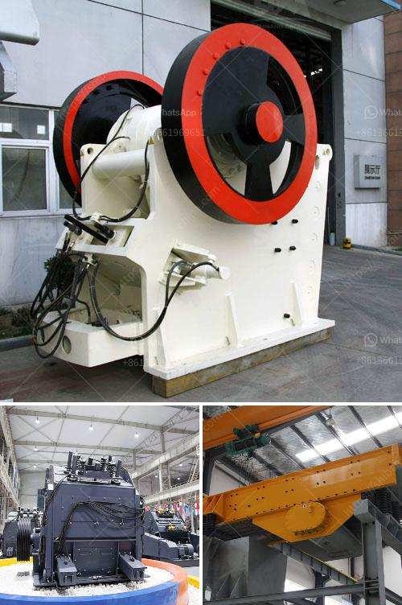

<h3>iron ore beneficiation plant suppliers</h3>
Iron ore beneficiation, or the process of separating iron ore from impurities like silica and alumina, is an essential step in modern metallurgical processes. It helps to improve the iron content and remove impurities present in low-grade ore. As a result, beneficiation enhances the value of the ore by increasing its iron content, making it suitable for steelmaking and other industries.

Suppliers play a crucial role in the success of any beneficiation plant. They not only provide the necessary equipment and machinery but also bring their expertise and experience to ensure smooth operations and efficient production. In this article, we will explore some of the top iron ore beneficiation plant suppliers in the industry.

One of the leading players in the iron ore beneficiation industry is CDE Global. With offices in India, Brazil, and Australia, their main focus is on providing innovative solutions to improve the efficiency of iron ore processing. CDE Global's equipment range includes attrition scrubbers, dewatering screens, log washers, jigs, and cyclone separators. They are known for their extensive research and development efforts to deliver cutting-edge technologies that maximize ore recovery and minimize environmental impact.

Another prominent supplier in the market is HDO (Heavy Duty Oils). They offer a wide range of customizable solutions for iron ore beneficiation plants, including design, engineering, and supply of equipment. HDO's expertise lies in its ability to integrate various unit operations and optimize the process flow to achieve the desired iron ore grade and recovery.

Multotec is another notable supplier in the iron ore beneficiation industry. With its global footprint and vast experience, Multotec offers a comprehensive range of equipment and services for both wet and dry beneficiation processes. Their portfolio includes spiral concentrators, magnetic separators, and other innovative technologies designed to increase the efficiency of iron ore processing plants.

When it comes to iron ore beneficiation plant suppliers, Outotec stands out with its comprehensive offering. They provide end-to-end solutions for the entire beneficiation plant lifecycle, ranging from pre-feasibility and scoping studies to complete plant design, construction, and commissioning. Outotec's expertise covers various beneficiation processes, including flotation, magnetic separation, and gravity separation.

These are just a few examples of the many suppliers in the iron ore beneficiation industry. The choice of supplier ultimately depends on various factors such as project requirements, budget, and quality standards. It is essential to collaborate closely with the selected supplier to ensure a successful and efficient beneficiation plant operation.

In conclusion, iron ore beneficiation plant suppliers play a crucial role in enhancing the value of low-grade iron ore and ensuring its suitability for downstream processes. The industry is populated by several leading players who offer a wide range of equipment, services, and expertise. By partnering with the right supplier and leveraging their experience and technology, iron ore producers can maximize their revenue and contribute to sustainable and responsible mining practices.
<h3>Contact us</h3><ul><li><strong>Whatsapp:&nbsp;<a href="https://wa.me/8613661969651">+8613661969651</a></strong></li><li><a href="https://swt.shibang-china.com/?git&amp;zhl&amp;iron ore beneficiation plant suppliers"><strong>Online Service(chat now)</strong></a></li></ul><h3>Related</h3><ul><li><a href='raymond mill and classifier.md'>raymond mill and classifier</a></li><li><a href='crushing complete crushing plant 80 120tph hard rock.md'>crushing complete crushing plant 80 120tph hard rock</a></li><li><a href='advantages of jaw crushers.md'>advantages of jaw crushers</a></li><li><a href='prices for cheap roller mills in south africa.md'>prices for cheap roller mills in south africa</a></li><li><a href='belt conveyor continental indonesia.md'>belt conveyor continental indonesia</a></li></ul>