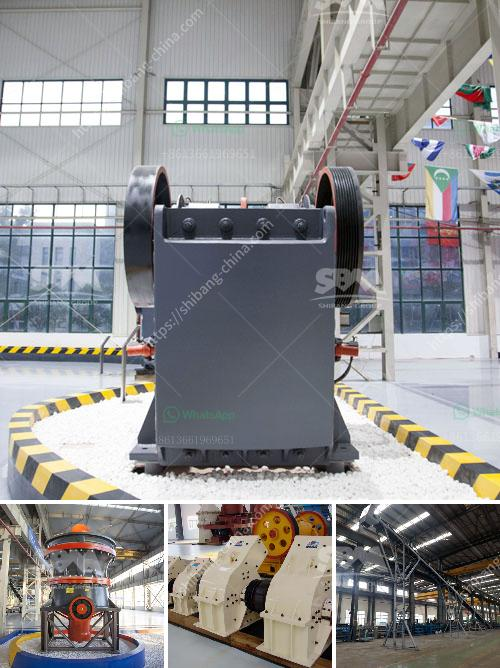

<h3>iron ore beneficiation proposal</h3>
Iron ore beneficiation refers to the process of purifying raw iron ore before smelting it. This process involves various types of iron ore beneficiation plants and equipment. The mineral processing of iron ore can involve various types of equipment depending on the needs of the iron ore beneficiation plant.

During the process of iron ore beneficiation, we need to analyze the composition of iron ore and then calculate its mineral composition, which determines the equipment that we choose. The most important iron ore beneficiation process is magnetic separation. However, flotation and agglomeration (pelletizing, sintering, briquetting, or nodulizing) can also be used.

The process of beneficiation of iron ore typically involves the crushing, grinding, and screening of the ore to produce particles with a suitable size range. The iron ore particles are then separated using magnetic separation techniques. The chemical composition of the ore plays a significant role in determining if this process is economically viable or not. The presence of impurities such as silica, alumina, and phosphorus can affect the iron content of the ore. Therefore, thorough testing and analysis are required to determine the ore's suitability for beneficiation.

Iron ore beneficiation can improve the quality and economic value of the ore by removing impurities. This process involves various steps, including crushing, grinding, and classifying iron ore particles, gravity separation, magnetic separation, and flotation.

The proposed beneficiation plant aims to improve the iron content by utilizing a series of equipment. The waste rock material is typically crushed and its iron content extracted using magnetic separation techniques. The resulting concentrate is then further refined through a process known as flotation, which involves adding specific chemicals to the ore to produce a froth with the desired iron content. This froth is then collected and processed to create the final iron concentrate.

The proposed beneficiation plant has the potential to significantly increase the economic value of the iron ore resource by increasing the iron content and reducing the overall impurities. This would allow for the extraction of a higher proportion of iron per ton of ore mined, increasing the profitability of the operation.

In conclusion, iron ore beneficiation is a complex process that aims to remove the unwanted impurities from the iron ore and improve the iron content. The proposed beneficiation plant in this article is capable of producing high-quality concentrate with ideal iron content. It can ultimately contribute to the economic viability of the mining operation by increasing the value of the extracted iron ore.
<h3>Contact us</h3><ul><li><strong>Whatsapp:&nbsp;<a href="https://wa.me/8613661969651">+8613661969651</a></strong></li><li><a href="https://swt.shibang-china.com/?git&amp;zhl&amp;iron ore beneficiation proposal"><strong>Online Service(chat now)</strong></a></li></ul><h3>Related</h3><ul><li><a href='gold washing equipment portable.md'>gold washing equipment portable</a></li><li><a href='diagram of coal conveyor tunnel.md'>diagram of coal conveyor tunnel</a></li><li><a href='stone crusher plant pakistan feasibility report.md'>stone crusher plant pakistan feasibility report</a></li><li><a href='mobile stone crusher machine price and cost.md'>mobile stone crusher machine price and cost</a></li><li><a href='gypsum grinding machine suppliers.md'>gypsum grinding machine suppliers</a></li></ul>