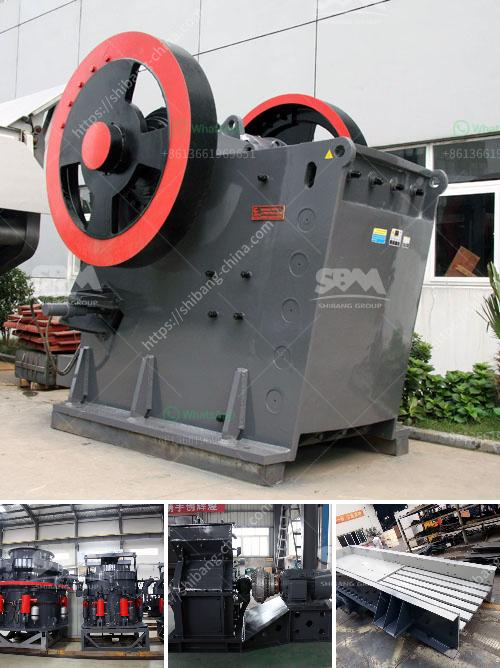

<h3>iron ore concentrate plant tpa production</h3>
Iron ore concentrate plants are located in Russia and Ukraine. A major player in the market is a leading company in Ukraine, Metinvest. It is a vertically integrated company with a high level of self-sufficiency in iron ore supply. They are operating two major iron ore concentrate plants in the country. One is located in Kryvyi Rih, in the central Ukraine, and the other one is in Southern Ukraine, close to two major Ukrainian ports. The concentrate produced in these plants are then transported to Europe and used in steel making.

Many factors influence the operation of iron ore pellet plants. One of them is the amount of concentrate produced per year.

The higher the production capacity, the more pellets can be produced. Many plants are designed to produce a certain maximum amount of concentrate, sometimes called the design capacity. However, due to various factors such as maintenance shutdowns or other unforeseen events, plants often operate at a lower capacity or at a capacity below the maximum.

For example, the Kryvyi Rih plant is designed to produce 7.5 million tons of concentrate per year, but the actual production capacity can be as high as 9 million tons. On the other hand, the Southern plant has a smaller production capacity, reaching only 2 million tons of concentrate per year.

The production of iron ore concentrate from iron ore pellets is an important part of the steel manufacturing process. Iron ore pellets are highly sought after by steelmakers, as they can be easily handled, transported, and charged into blast furnaces, as opposed to traditional iron ore, which must first be mined, processed into a concentrate, and then agglomerated into pellets before being used in the steelmaking process.

Iron ore concentrate plants typically operate at higher production rates with less downtime and lower maintenance costs than traditional iron ore pellet plants. As the demand for iron ore concentrate increases, plants are also striving to reduce their environmental impact by using advanced processing techniques, such as gravity separation or magnetic separation, to remove impurities from the concentrate.

In summary, iron ore concentrate plants play a crucial role in the steel industry, producing high-quality pellets for use in blast furnaces. The production capacity of these plants varies, depending on factors such as maintenance and unforeseen events. However, the goal of these plants is to operate at maximum capacity to meet the growing demand for iron ore concentrate. With the use of advanced processing techniques, these plants are also working to reduce their environmental impact.
<h3>Contact us</h3><ul><li><strong>Whatsapp:&nbsp;<a href="https://wa.me/8613661969651">+8613661969651</a></strong></li><li><a href="https://swt.shibang-china.com/?git&amp;zhl&amp;iron ore concentrate plant tpa production"><strong>Online Service(chat now)</strong></a></li></ul><h3>Related</h3><ul><li><a href='stone crushing company in philippines.md'>stone crushing company in philippines</a></li><li><a href='gypsum plant price.md'>gypsum plant price</a></li><li><a href='stone crusher machines from denmark.md'>stone crusher machines from denmark</a></li><li><a href='gold production process flow chart.md'>gold production process flow chart</a></li><li><a href='hammer mill manufacturer in tamilnadu.md'>hammer mill manufacturer in tamilnadu</a></li></ul>