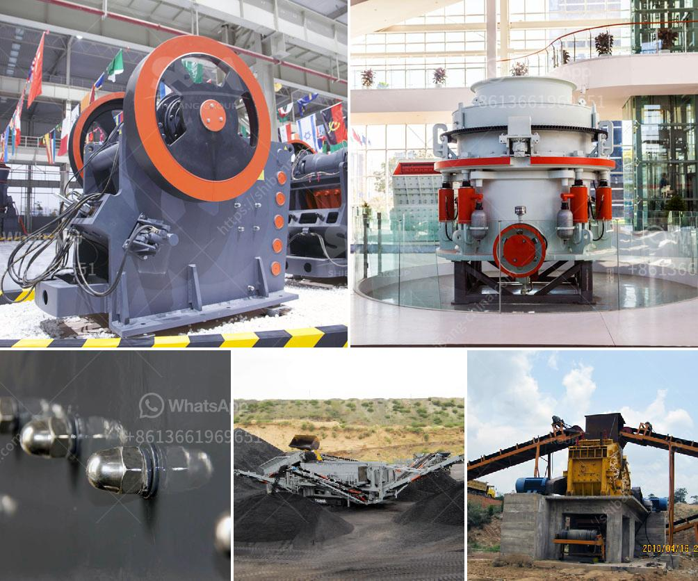

<h3>iron ore cruseher plant</h3>
Iron ore is a crucial resource in the development of any industrialized nation. While iron ore is used in the manufacturing of various products such as magnets, cars, and appliances, it is also the main ingredient in the production of steel. Steel is used in construction, transportation, and infrastructure, making it a vital material for the development and progress of any country.

To extract iron from its ore, a significant amount of process goes into it. One important step in this process is the crushing of the iron ore. This crushing stage is typically performed by a gyratory or cone crusher, which reduces the ore particles into smaller sizes. These particles then proceed to the next stage of processing.

The iron ore crusher plant equipment is primary and crusher, and can crush iron ore into small sizes, which decreases the cost of iron ore coarse crushing. It can crush iron ore into small sizes. Thus, these small iron ore can enter into the iron ore mill like ball mill for grinding. These iron ore crusher plants in Nigeria have the features of reasonable matching, unobstructed discharge all line, reliable working, convenient operation, high efficiency and low energy consumption.

The key equipment in the whole iron ore crushing production line is the Iron Ore Crusher Plant. It is applied to non-metallic minerals in layer mining, building materials in mining industry, teleportation and hydroelectric industry, etc.

Some major advantages of using iron ore crusher plants are it can process various ores such as limestone, basalt, granite, iron ore, and even non-ferrous metals. Additionally, this crushing equipment is designed to reduce large-sized rocks or ores into smaller and more manageable sizes. This not only saves energy but also enhances operational efficiency by reducing the load on downstream processes.

Another noteworthy feature of iron ore crusher plants is their high adaptability and flexibility. These plants can be customized according to the specific needs of different industries and projects. This ensures that the crusher plant can effectively meet the production requirements of various iron ore processing plants.

Furthermore, iron ore crusher plants are available in both stationary and portable configurations. This means that they can be easily transported and set up at different mining sites, offering convenience and convenience to mining operations.

In conclusion, iron ore crusher plants play a significant role in improving the efficiency and productivity of iron ore processing operations. They are essential for the extraction of iron from its ore and the production of steel. With their superior crushing capabilities and adaptability, these plants help in reducing costs, enhancing operational efficiency, and meeting the production requirements of different industries. As the demand for iron ore continues to rise, the importance of iron ore crusher plants will only grow, ensuring a sustainable future for the mining industry and industrial development as a whole.
<h3>Contact us</h3><ul><li><strong>Whatsapp:&nbsp;<a href="https://wa.me/8613661969651">+8613661969651</a></strong></li><li><a href="https://swt.shibang-china.com/?git&amp;zhl&amp;iron ore cruseher plant"><strong>Online Service(chat now)</strong></a></li></ul><h3>Related</h3><ul><li><a href='crusher size 1 ton capacity hour.md'>crusher size 1 ton capacity hour</a></li><li><a href='ball mill ball mill factories.md'>ball mill ball mill factories</a></li><li><a href='stone quarrying companies in tanzania.md'>stone quarrying companies in tanzania</a></li><li><a href='crusher machine philippines.md'>crusher machine philippines</a></li><li><a href='portable cone crusher specification.md'>portable cone crusher specification</a></li></ul>