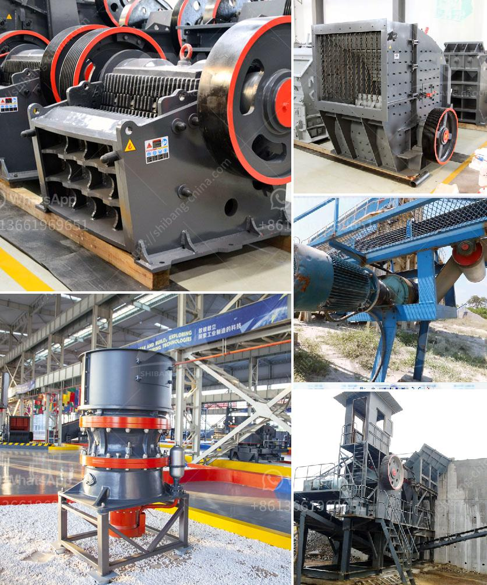

<h3>iron ore crushed machine second hand</h3>
Iron ore refers to the substance which contains iron elements or iron compounds. It can be further processed to obtain metallic iron. Iron ore is a crucial raw material for steel production, and its importance in the global economy is unmatched. As a result, the demand for iron ore is high, and the need for crushing machines or equipment that can break the iron ore efficiently is also increasing.

One popular machine used in crushing is the "jaw crusher." This is a primary crusher that is typically used to crush large pieces of ore into smaller particles. The jaw crusher consists of two jaw plates, one which remains stationary and another that moves back and forth relative to it. These jaw plates crush the iron ore against the stationary plate, ensuring that the particles are broken into manageable sizes.

During the crushing process, the iron ore is fed into the jaw crusher to be crushed. The crushed material then passes through the discharge opening at the bottom, where it is discharged from the machine. Depending on the desired size of the crushed material, the gap between the jaws can be adjusted.

While new jaw crushers are available in the market, purchasing second-hand machines can be a cost-effective alternative. Second-hand jaw crushers offer the same high quality and performance as new ones but at a lower price. This makes them an attractive option for budget-conscious buyers who are looking to upgrade their equipment without breaking the bank.

Second-hand jaw crushers also contribute to sustainable development. By extending the life cycle of these machines, resources are conserved since new resources are not required for manufacturing. Alternatively, the cost and energy associated with recycling or disposing of old machines are reduced.

However, there are a few things to consider when purchasing a second-hand jaw crusher. First, it is essential to inspect the condition of the machine thoroughly. Check for any damage or wear and tear that may affect its performance. It is also advisable to inquire about its maintenance history and whether any significant repairs have been conducted.

Additionally, ensure that the second-hand jaw crusher comes with a warranty or a guarantee of its working condition. This will provide assurance that the machine is reliable and functional.

Lastly, consider the cost of operating the second-hand machine. Evaluate fuel consumption, maintenance costs, and spare parts availability. Although purchasing a second-hand jaw crusher may initially save money, if the machine has high operational costs, it might not be the most cost-effective option in the long run.

In conclusion, the demand for iron ore crushed machines is high in the steel industry, and second-hand jaw crushers offer a cost-effective alternative. To ensure the machine's reliability, inspect its condition thoroughly, and inquire about its maintenance history. Consider the operational costs and compare them with new machines to make an informed decision. With these considerations in mind, a second-hand jaw crusher can be an excellent investment for iron ore crushing needs.
<h3>Contact us</h3><ul><li><strong>Whatsapp:&nbsp;<a href="https://wa.me/8613661969651">+8613661969651</a></strong></li><li><a href="https://swt.shibang-china.com/?git&amp;zhl&amp;iron ore crushed machine second hand"><strong>Online Service(chat now)</strong></a></li></ul><h3>Related</h3><ul><li><a href='small mining equipment price in south africa.md'>small mining equipment price in south africa</a></li><li><a href='crusher plant supplier.md'>crusher plant supplier</a></li><li><a href='basalt processing line.md'>basalt processing line</a></li><li><a href='mobile gold refinery for sale.md'>mobile gold refinery for sale</a></li><li><a href='hydraulic stone crusher for hire uk.md'>hydraulic stone crusher for hire uk</a></li></ul>