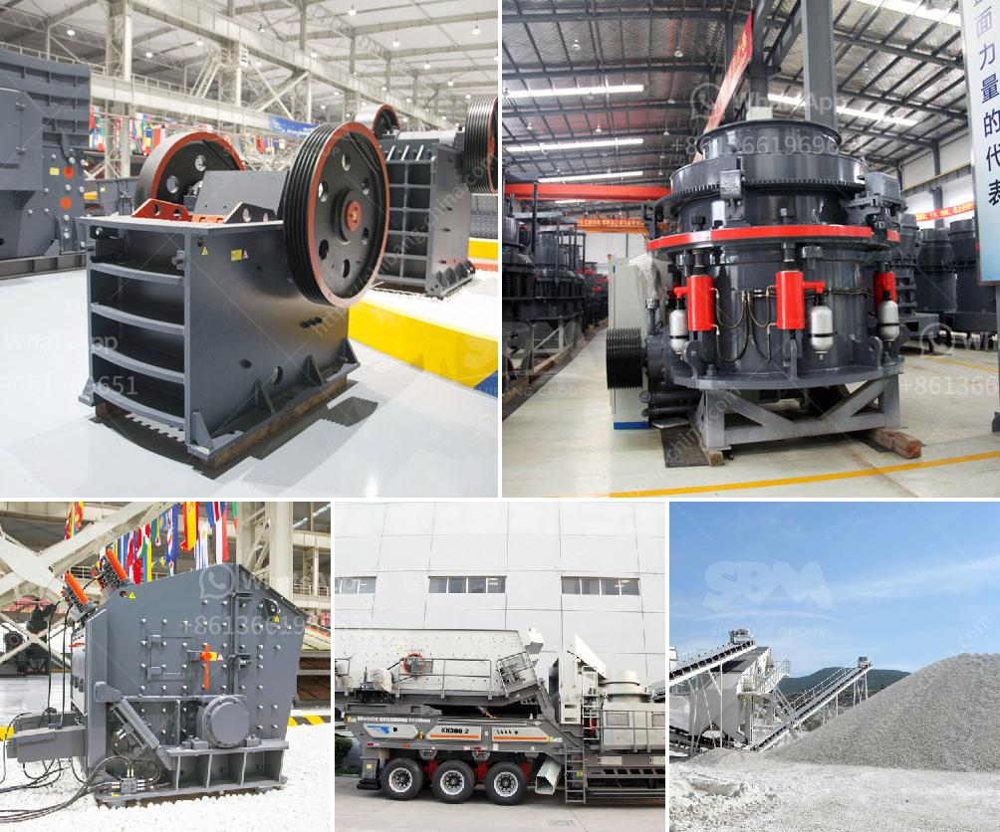

<h3>iron ore mining cost breakdown</h3>
Iron ore is one of the most abundant resources on Earth, making it a crucial component for countless industries. From construction to automotive, iron ore is vital for producing steel, a fundamental material used in the manufacturing of infrastructure, machinery, and various consumer goods. However, mining and extracting iron ore entail costs that need to be carefully assessed to ensure a profitable operation.

Iron ore mining is an extensive and complex process that consists of multiple stages, including exploration, extraction, crushing, grinding, beneficiation, and transportation. These processes contribute to the overall cost breakdown of iron ore mining. Let's explore the essential components of this cost breakdown.

Exploration is the initial stage of iron ore mining, essential for determining potential deposit locations. Geological studies, surveying, and mapping are conducted to identify areas with high ore concentration. However, the costs incurred during exploration are relatively small compared to the subsequent stages.

Extraction is the next step, where heavy machinery such as drills, shovels, and trucks are used to extract the iron ore from the ground. Various extraction methods, including open-pit and underground mining, are employed, each with its associated costs. Open-pit mining is cost-effective for shallow ore deposits, requiring earthmoving equipment, explosives, and labor. In contrast, underground mining is more expensive due to the specialized machinery, ventilation systems, and safety measures necessary for working at depth.

Crushing and grinding are crucial processes in preparing the extracted iron ore for further refining. Large pieces of ore are crushed into smaller particles, increasing surface area and facilitating subsequent separation. The costs associated with these processes include energy consumption, maintenance of crushers and grinders, and labor expenses.

Beneficiation, also known as ore dressing or mineral processing, involves the separation of valuable minerals from the iron ore. Various techniques, such as magnetic separation, flotation, and gravity separation, are utilized to remove impurities and upgrade the ore grade. Beneficiation costs encompass the use of chemicals, water, energy, and specialized equipment.

After beneficiation, the final product is transported to steel mills or export terminals. Transportation costs depends on factors such as distance, mode of transportation (rail, road, or sea), and infrastructure availability. Rail transportation is commonly used for domestic transportation, while maritime shipping is crucial for international trade. Costs include fuel, maintenance of transportation infrastructure, and labor.

Additionally, environmental and regulatory compliance expenses form a significant portion of the overall cost breakdown. Mining operations must comply with environmental regulations, which may require investments in waste management systems, land rehabilitation, and environmental monitoring. These costs aim to mitigate the environmental impact of mining activities and ensure sustainable practices.

In conclusion, iron ore mining involves a range of interdependent processes, each contributing to the overall cost breakdown. From exploration to transportation, the costs associated with mining iron ore are diverse and should be carefully considered to ensure profitability. Understanding the key components of this cost breakdown allows mining operators to make informed decisions and optimize their operations accordingly. Additionally, embracing sustainable practices not only reduces environmental impact but also enhances long-term profitability by minimizing the costs of environmental compliance.
<h3>Contact us</h3><ul><li><strong>Whatsapp:&nbsp;<a href="https://wa.me/8613661969651">+8613661969651</a></strong></li><li><a href="https://swt.shibang-china.com/?git&amp;zhl&amp;iron ore mining cost breakdown"><strong>Online Service(chat now)</strong></a></li></ul><h3>Related</h3><ul><li><a href='equipment equipments used in gravel crushing.md'>equipment equipments used in gravel crushing</a></li><li><a href='jaw crusher in uzbekistan.md'>jaw crusher in uzbekistan</a></li><li><a href='design and sizing of a gold processing plant pdf.md'>design and sizing of a gold processing plant pdf</a></li><li><a href='small jaw crusher for sale in california.md'>small jaw crusher for sale in california</a></li><li><a href='maintenance plan of crusher.md'>maintenance plan of crusher</a></li></ul>