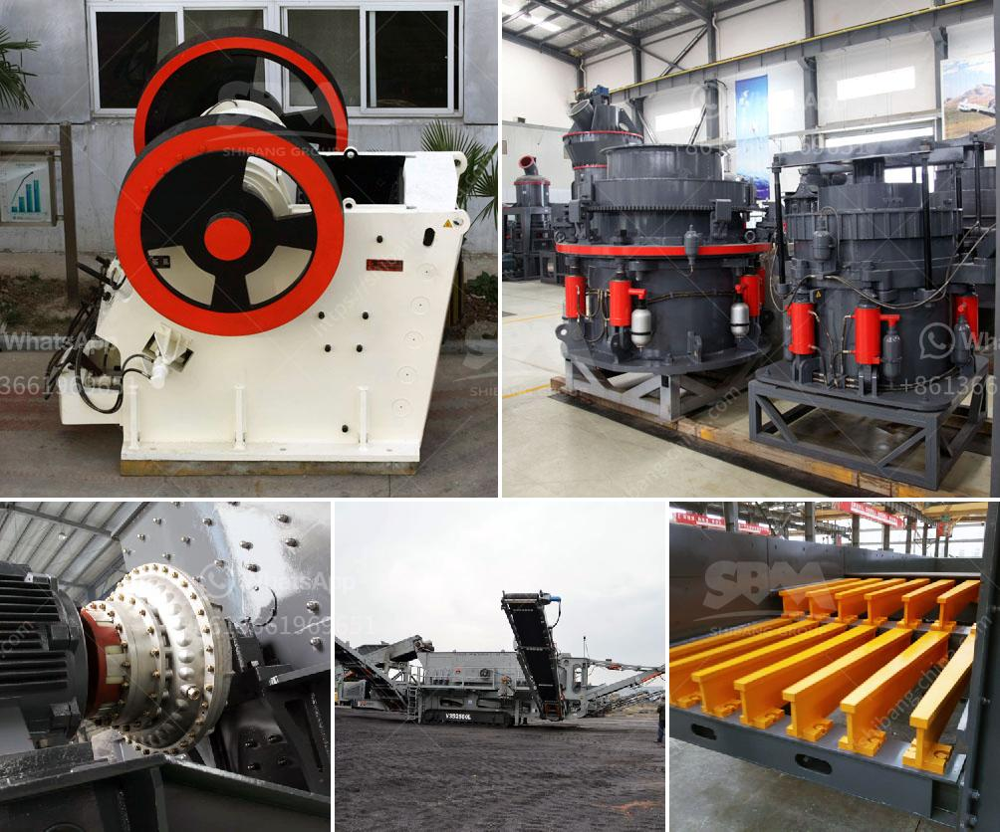

<h3>iron ore processing plant for sale</h3>
An iron ore processing plant for sale is a unique opportunity for the mining industry. Raw iron ore materials are processed to refine and create various iron products used in various industries such as steel production. The operation of an iron ore processing plant involves multiple stages of crushing, grinding, classification, and concentration. The end result is a wide range of different iron ore products, such as iron ore pellets, iron ore fines, or lump ore, which are suitable for various purposes.

One of the primary advantages of investing in an iron ore processing plant for sale is the potential for high profitability. Iron ore is in great demand globally due to its crucial role in the production of steel, which is used extensively in the construction, automotive, and manufacturing industries. As a result, there is a constant need for iron ore processing plants to meet this demand and provide high-quality iron products to various customers.

The process of iron ore processing typically begins with the extraction of raw ore from a mine. This raw ore is then crushed, ground, and classified into various sizes and grades. The ore is then further processed through a series of concentration steps to remove impurities and increase the iron content. This can involve the use of magnetic separators, floatation cells, or gravity concentration methods, depending on the specific characteristics of the ore.

Once the ore has been concentrated, it can be processed into a variety of iron ore products. The most common product is iron ore pellets, which are small balls of iron ore that are used in the production of steel. These pellets are created by heating the concentrate to high temperatures and then rolling them into shape. Iron ore fines, which are smaller particles of iron ore, can also be produced for use in other applications, such as in the production of cement or in the manufacturing of iron-based chemicals.

Investing in an iron ore processing plant for sale can be a lucrative venture, as the demand for iron ore is expected to continue to rise in the coming years. Additionally, the operation of an iron ore processing plant can provide employment opportunities and contribute to the local economy. For prospective buyers, it is important to thoroughly evaluate the quality and potential of the ore reserves associated with the processing plant, as well as the efficiency and reliability of the plant's equipment and processes.

In conclusion, an iron ore processing plant for sale offers a unique opportunity for investors in the mining industry. With the increasing demand for iron ore, owning and managing a processing plant can lead to high profitability. However, careful evaluation of the ore reserves and the efficiency of the processing plant is essential for the success of the venture. Iron ore processing plants play a crucial role in meeting the global demand for iron products, which are essential for various industries.
<h3>Contact us</h3><ul><li><strong>Whatsapp:&nbsp;<a href="https://wa.me/8613661969651">+8613661969651</a></strong></li><li><a href="https://swt.shibang-china.com/?git&amp;zhl&amp;iron ore processing plant for sale"><strong>Online Service(chat now)</strong></a></li></ul><h3>Related</h3><ul><li><a href='stone crushing machine manufacturers in japan.md'>stone crushing machine manufacturers in japan</a></li><li><a href='machinery needed for limestone extraction.md'>machinery needed for limestone extraction</a></li><li><a href='jaw crusher 10 x 36 sulit.md'>jaw crusher 10 x 36 sulit</a></li><li><a href='prices of cement clinker grinding unit in india.md'>prices of cement clinker grinding unit in india</a></li><li><a href='ethiopia crusher jaw crusher.md'>ethiopia crusher jaw crusher</a></li></ul>