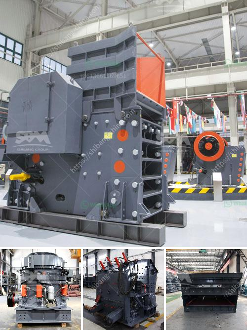

<h3>iron ore wet processing plant</h3>
Iron ore is a mineral substance which, when heated in the presence of a reductant, will yield metallic iron (Fe). It almost always consists of iron oxides, the primary forms of which are magnetite (Fe3O4) and hematite (Fe2O3). Iron ore is the source of primary iron for the world's iron and steel industries. It is therefore essential for the production of steel, which in turn is essential to maintain a strong industrial base.

Iron ore is a wide range of uses. Iron ore beneficiation process plant Iron ore process plant, the world's iron ore resources are concentration australia wide, Brazil, Ukraine, Russia, Kazakhstan, India, the usa, Nigeria, Canada as well as other countries.

Nearly all iron ore experiences iron ore processing and it is utilized to make steel. Iron ore processing can be a procedure that contains explosions, shoveling, moving, crushing, grinding, pelletizing etc. Iron ore processing provides a range of coarse sizing that may produce material in 24-inch to .0017-inch particle sizes. In iron ore crushing and screening process is really a basic connect to concentrator will have an effect on producing indicators.

Methods accustomed to include jaw crushing, impact crushing, roll crushing, and pulverizing. To make iron ore size as fine as you can before entering into ball mill, iron ore processors are usually use cone crushers in pre-grinding stage, cone crusher come with an excellent fine crushing power to minish iron ore size. In coarse crushing, 2.1m or 2.2m gyratory crusher is usually being selected, in medium crushing process, processer usually use regular cone crusher, plus fine crushing, short-head kind cone crusher would work.

The actual iron ore beneficiation line includes magnetic separation as well as flotation separation with regard to mineral processing. Magnetic separation line with regard to ferrous metal is a kind of beneficiation procedure for roughing out the weak magnetic materials as well as the non-magnetic materials.

The actual flotation separation is actually important role within the titanium ore beneficiation procedure. The goal of titanium ore beneficiation would be to eventually acquire the products with suitable grade and size-range and nanometer iron ore beneficiation technology, to further improve the grade of titanium-iron materials.

Iron ore wet processing plants adopt the latest technology and introduce new concept in ore processing field, which will help to reduce the metallic contamination and improve the composition of ore. It is also the reason for the reduced cost of ore processing. The major benefit of fully autogenous grinding is the elimination of steel grinding media costs and the need to discriminate between steel and magnetite in coarse magnetic separation. The separation step between grinding stages progressively reduces the amount of material to be ground and, in some cases, eliminates the grinding step completely. Consequently crushing and screening plants produce significant amounts of excess fines so they should be included in the crushing and screening plants designs. 

In conclusion, iron ore reserves are limited and valuable, and the most significant remaining untapped iron resources are in Western Australia, Canada, Russia, Ukraine, and other countries. Iron ore wet processing plants play a vital role in the production of steel, helping to keep the industrial base strong and innovative. The processing of iron ore using these plants reduces the amount of unwanted contaminants, resulting in refined and higher-quality ore.
<h3>Contact us</h3><ul><li><strong>Whatsapp:&nbsp;<a href="https://wa.me/8613661969651">+8613661969651</a></strong></li><li><a href="https://swt.shibang-china.com/?git&amp;zhl&amp;iron ore wet processing plant"><strong>Online Service(chat now)</strong></a></li></ul><h3>Related</h3><ul><li><a href='jaw crusher and impact crusher made in japan.md'>jaw crusher and impact crusher made in japan</a></li><li><a href='grinding machine types use in cement industry.md'>grinding machine types use in cement industry</a></li><li><a href='raymond hammer mill.md'>raymond hammer mill</a></li><li><a href='second hand stone crushing plants india.md'>second hand stone crushing plants india</a></li><li><a href='quarry equipment and crushers companies in japan.md'>quarry equipment and crushers companies in japan</a></li></ul>