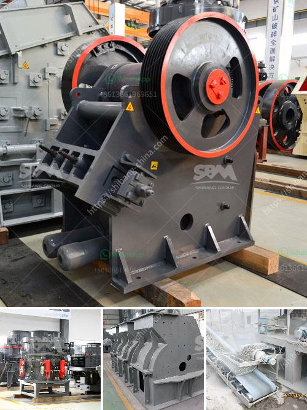

<h3>iron slag crushing ball mill price</h3>
Iron slag is a common byproduct in the industrial sector. The traditional way to dispose of iron slag is by dumping it as waste, which can cause environmental pollution. Moreover, this approach wastes valuable iron resources and increases production costs. However, with the development of technology, iron slag can now be recycled through various methods, such as crushing and grinding. Among these methods, the ball mill is widely used due to its high efficiency and low cost.

The ball mill is a horizontal cylindrical rotating device with external gear transmission. It consists of two chambers, separated by a lattice plate. The material enters the first chamber through the feeding inlet, where it is ground into smaller particles by impact and abrasion. The crushed material then enters the second chamber, where further grinding occurs. Finally, the finely ground material is discharged through the outlet.

Iron slag crushing ball mill is widely used in cement, silicate products, new building materials, refractory materials, fertilizer, ferrous and non-ferrous metal and glass ceramics and other production industries, all kinds of ores and other grind-able materials can be dry or wet grinding. The raw material is fed into the ball mill through the feeding device, and the ground material is continuously discharged through the discharging device.

The price of iron slag crushing ball mill varies according to different models, production capacity, and optional equipment. As a professional manufacturer of iron slag crushing ball mill, Hongxing Machinery can provide various types of ball mill equipment, and provide customized iron slag crushing ball mill prices according to customers' needs.

Through continuous innovation and improvement, Hongxing Machinery has developed a series of iron slag crushing ball mills with excellent performance and high grinding efficiency. The iron slag crushing ball mill produced by Hongxing Machinery has fine workmanship, reliable quality and low price. The grinding chamber of the ball mill adopts a unique structural design, which effectively increases the grinding area and improves the grinding efficiency. The grinding parts of the ball mill are made of high-strength steel, which can better withstand the grinding of iron slag.

The price of iron slag crushing ball mill can be accurately selected according to your needs. We have a professional quotation specialist who will recommend the appropriate ball mill model and specifications for you, and provide detailed quotations. Our iron slag crushing ball mill price is very competitive and fair. Welcome to consult and purchase.

In summary, iron slag crushing ball mill has a variety of advantages, including high grinding efficiency, low cost, environmental protection, and energy saving. It is an ideal choice for the preparation of iron slag in the industrial sector. Hongxing Machinery is a professional manufacturer of iron slag crushing ball mill, providing various models and high-quality equipment at preferential prices. Choose Hongxing Machinery, and let us create a better future together.
<h3>Contact us</h3><ul><li><strong>Whatsapp:&nbsp;<a href="https://wa.me/8613661969651">+8613661969651</a></strong></li><li><a href="https://swt.shibang-china.com/?git&amp;zhl&amp;iron slag crushing ball mill price"><strong>Online Service(chat now)</strong></a></li></ul><h3>Related</h3><ul><li><a href='talcum powder mill manufacturing.md'>talcum powder mill manufacturing</a></li><li><a href='jual stone crusher plant kredit.md'>jual stone crusher plant kredit</a></li><li><a href='wet grinder price in nigeria.md'>wet grinder price in nigeria</a></li><li><a href='hammer mill in bogota.md'>hammer mill in bogota</a></li><li><a href='stone to sand crusher.md'>stone to sand crusher</a></li></ul>