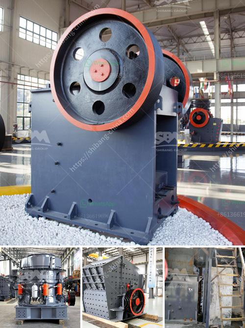

<h3>japan mobile stone crusher machine</h3>
Japan mobile stone crusher machine includes mobile jaw crusher,mobile cone crusher,mobile impact crusher as well as hydraulic tracked mobile plant. Price of mobile stone crushers vary from different types. Shanghai SBM is a professional mining processing machine manufacturer and supplier in the world. Hydraulic-Driven Track Mobile Plant

It is SBM’s newest mobile crushing and screening plant, which is fully driven by hydraulic force and moves by chassis track. It is designed by our company’s excellent engineers to meet growing market demand. It features high performance, high reliability, elegant design and top international techniques.

This type of mobile plant can be widely used for crushing and screening in many areas such as road construction, building, metallurgical and energy industries, etc. In the concrete production line, our mobile crusher can process concrete, coal, rock, limestone, granite, aggregate, gravel, basalt, quartz, iron ore, gold ore, and other kinds of stones.

The mobile crusher is usually called mobile crushing plant, mobile crusher station or portable crusher. Benefits of Mobile Crusher

The mobile crushing plant has the advantages of easy transportation, low transportation cost, flexible configuration, convenient maintenance etc. It can be operated as independent units, or as two-stage crushing plant with primary and secondary crushing, or as three-stage crushing plant with primary, secondary, and tertiary crushing according to different clients' requirements. Likewise, it can be easily adjusted to suit the crushing application by choosing feeding to crusher or feeding to screen options.

Zenith is world leading supplier and manufacturer of mobile crushing plant. The heavy-range of tracked crushing and screening solutions provides customer various applications and high production efficiency. The mobile crushing equipment range involves jaw crusher, cone crusher and impact crushers etc. The heavy-duty mobile crushers combines high mobility with high productivity, without the loss of flexibility of operation. An excellent choice for the producer who requires quick setup and mobility with a medium size stone crushing plant.

With over 20 years of experience, SBM ensures that the machine will offer you the best overall performance, mobility and cost-effectiveness. High capacity and a good crushing ratio are guaranteed by the proven jaw crusher. As the most powerful jaw crusher in the market, it features a robust, special high-quality steel structure for long life and a unique modular, bolted design for reduced metal fatique and greater reliability. The mobile stone crushers are capable of crushing, rocks / stone boulders, Iron Ore, Lime Stone, Coal, Basalt, blue metal stone, granite and jelly etc.

SBM Mobile Crushing Plant can be divided into Track type mobile crusher and Wheel type mobile crusher according to different /combined by many different models, the machine can meet various demands of different crushing requirements.

For example, the products include: jaw crusher, cone crusher, mobile stone crusher, mobile jaw crusher, portable crusher and so on.

Mobile stone crusher machine is widely used in mining, construction, railway, highway, metallurgy and other industries. It is suitable for all kinds of hard materials and crushing operations, such as granite, basalt, limestone, quartz and so on. With the development of modern technology, mobile stone crusher machine has various types and models for selection. It is flexible and convenient to move on the working site, greatly saving the transportation cost and process time. Therefore, mobile stone crusher machine is an excellent choice which is cost-effective and highly efficient.
<h3>Contact us</h3><ul><li><strong>Whatsapp:&nbsp;<a href="https://wa.me/8613661969651">+8613661969651</a></strong></li><li><a href="https://swt.shibang-china.com/?git&amp;zhl&amp;japan mobile stone crusher machine"><strong>Online Service(chat now)</strong></a></li></ul><h3>Related</h3><ul><li><a href='artificial sand making.md'>artificial sand making</a></li><li><a href='counties roller mills.md'>counties roller mills</a></li><li><a href='coal washing plant indonesia.md'>coal washing plant indonesia</a></li><li><a href='canber de broage ciment.md'>canber de broage ciment</a></li><li><a href='sand washing machine cost.md'>sand washing machine cost</a></li></ul>