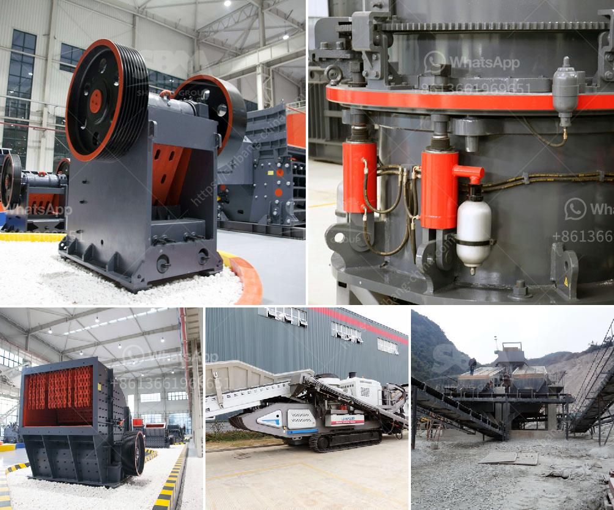

<h3>japan stone crushing machines</h3>
Japan is known for its futuristic technology and innovative machinery. As such, it comes as no surprise that Japan is home to some of the most advanced crushing machines in the world. With the increasing demand for stone products, especially for infrastructure projects, Japan has become a leading player in providing cutting-edge stone crushing machinery.

Stone crushing machines are used in a range of applications such as mining, construction, building materials, and recycling. These machines are designed to crush stones into smaller pieces, thereby facilitating the subsequent process of stone extraction, sorting, and shaping.

One of the primary advantages of Japanese stone crushing machines is their versatility. These machines can produce a variety of stone products, including standard sizes of aggregates, gravel, sand, and concrete products, depending on the desired specifications of the end-users. This adaptability makes them suitable for a wide range of projects, such as road construction, railway track ballast, concrete production, and landscaping.

In addition to their versatility, Japan stone crushing machines are renowned for their durability. Japanese manufacturers pay great attention to the quality and longevity of their machines, ensuring that they can withstand the harshest working conditions. This is achieved through the use of high-quality materials and advanced engineering techniques, resulting in machines that are built to last.

Efficiency is another key feature of Japanese stone crushing machines. These machines are designed to operate at high speeds, allowing for faster stone processing and increased productivity. With advanced technology and sophisticated control systems, these machines can significantly reduce the time and effort required to complete stone crushing tasks.

Furthermore, Japan stone crushing machines are also known for their user-friendliness. Manufacturers understand the importance of simplicity and ease of operation, ensuring that their machines can be easily operated by individuals with minimal training. This accessibility allows for increased efficiency and flexibility, as operators can quickly learn to operate the machines and adjust them according to the specific requirements of each project.

Environmental considerations are also taken into account in the design of Japanese stone crushing machines. These machines are equipped with advanced dust suppression and noise reduction systems, minimizing the impact on the surrounding environment. Additionally, manufacturers constantly strive to improve the energy efficiency of their machines, reducing energy consumption and carbon emissions.

In conclusion, Japanese stone crushing machines have established themselves as reliable, efficient, and versatile equipment in the stone processing industry. Their durability, efficiency, user-friendliness, and environmental considerations make them an ideal choice for various stone crushing applications. With their constant drive for innovation and improvement, Japanese manufacturers continue to lead the way in providing cutting-edge stone crushing machinery that meets the evolving needs of the industry.
<h3>Contact us</h3><ul><li><strong>Whatsapp:&nbsp;<a href="https://wa.me/8613661969651">+8613661969651</a></strong></li><li><a href="https://swt.shibang-china.com/?git&amp;zhl&amp;japan stone crushing machines"><strong>Online Service(chat now)</strong></a></li></ul><h3>Related</h3><ul><li><a href='how does a jaw crusher limestone.md'>how does a jaw crusher limestone</a></li><li><a href='used rock roll crusher.md'>used rock roll crusher</a></li><li><a href='cone crusher deos in mexico.md'>cone crusher deos in mexico</a></li><li><a href='cement plant machinery manufacturers.md'>cement plant machinery manufacturers</a></li><li><a href='hammer mill production location in nigeria.md'>hammer mill production location in nigeria</a></li></ul>