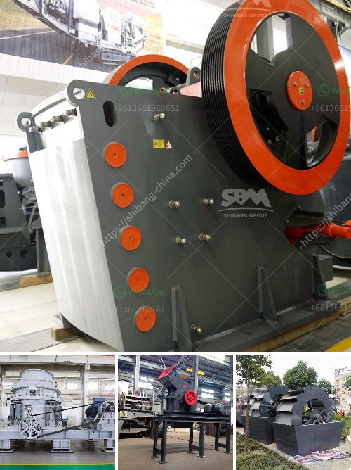

<h3>jaw crusher 10 x 20</h3>
The jaw crusher 10 x 20 is a versatile and powerful machine that is designed to give optimal performance and efficiency. With a jaw capacity of 10 x 20 inches, this machine is able to easily crush larger rocks into gravel or smaller pieces for mining or construction purposes.

One of the key features of the jaw crusher 10 x 20 is its ability to handle hard rock materials without difficulty. Whether it is granite, basalt, limestone, or any other hard rock material, this machine is able to handle it with ease. Its powerful motor and strong jaw plates allow it to crush even the toughest materials efficiently.

In addition to its crushing capabilities, the jaw crusher 10 x 20 also offers a range of adjustable settings, allowing users to choose their desired output size. This flexibility makes it suitable for a variety of applications, such as road construction, building materials, and even recycling. Whether you need a fine material for a specific purpose or a coarser product for a different application, this machine can deliver.

Another advantage of the jaw crusher 10 x 20 is its compact size and easy portability. Despite its powerful features, this machine can be easily transported from one location to another, making it ideal for mobile operations or temporary projects. Its small footprint also means that it can be easily stored when not in use, saving valuable space in your workspace or construction site.

The jaw crusher 10 x 20 also features a user-friendly control panel that allows operators to easily adjust and monitor the machine. With just a few simple steps, users can adjust the speed, set the desired output size, and even check the machine's operating status. This intuitive control panel makes operating the jaw crusher a breeze, even for beginners.

Maintenance and servicing of the jaw crusher 10 x 20 are also made easy. The machine is designed for quick and simple maintenance, with easy access to the motor, jaw plates, and other components. Regular maintenance ensures the machine's longevity and optimal performance, minimizing downtime and maximizing productivity.

In conclusion, the jaw crusher 10 x 20 is a powerful and versatile machine that offers efficient crushing capabilities for a variety of applications. Whether you need to crush hard rock materials or produce smaller-sized gravel, this machine is up to the task. Its compact size, easy portability, and user-friendly controls make it a convenient choice for mobile operations or temporary projects. With regular maintenance and servicing, this machine can provide years of reliable service and help increase productivity in your mining or construction projects.
<h3>Contact us</h3><ul><li><strong>Whatsapp:&nbsp;<a href="https://wa.me/8613661969651">+8613661969651</a></strong></li><li><a href="https://swt.shibang-china.com/?git&amp;zhl&amp;jaw crusher 10 x 20"><strong>Online Service(chat now)</strong></a></li></ul><h3>Related</h3><ul><li><a href='quartz processing plant.md'>quartz processing plant</a></li><li><a href='sand making machine equipment.md'>sand making machine equipment</a></li><li><a href='limestone grinding system.md'>limestone grinding system</a></li><li><a href='new technology stone crusher in india.md'>new technology stone crusher in india</a></li><li><a href='japan stone crushing machines.md'>japan stone crushing machines</a></li></ul>