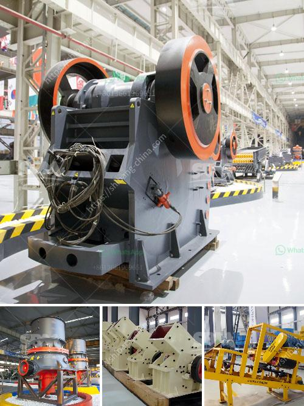

<h3>jaw crusher 10 x 36 sulit</h3>
The jaw crusher 10 x 36 Sulit is a versatile crushing equipment that is widely used in mining, construction, and recycling industries. This machine, also known as the "Blake crusher," due to its jaw-like shape, operates by crushing materials between two jaws.

One of the key features of the jaw crusher 10 x 36 Sulit is its size. With a width of 10 inches and a length of 36 inches, this crusher can easily accommodate larger materials, making it ideal for handling various types of rocks, ores, and even concrete debris. Its compact design also makes it easy to transport and store, ensuring convenience and efficiency for operators.

Equipped with a powerful motor, the jaw crusher delivers high-performance crushing capabilities. It boasts a maximum feed size of up to 8 inches, allowing it to process large rocks and minerals effortlessly. The adjustable jaw setting allows users to regulate the size of the crushed materials, yielding different final products based on specific requirements.

The jaw crusher 10 x 36 Sulit is also known for its durability and low maintenance. The sturdy construction ensures reliable performance even in harsh operating conditions, while the high-quality components enhance longevity and reduce the need for costly repairs. Regular lubrication and preventive maintenance further contribute to extending the lifespan of this crusher.

In addition, the jaw crusher 10 x 36 Sulit offers a simple and straightforward operation. With a user-friendly control panel and clear instructions, operators can quickly familiarize themselves with the machine and operate it with ease. This crusher also features a safety toggle plate, which provides an added layer of protection for operators in case of a malfunction.

Overall, the jaw crusher 10 x 36 Sulit is a reliable and efficient crushing solution for various applications. Its compact design, powerful motor, and adjustable settings make it suitable for processing different types of materials. Whether used in mining, construction, or recycling, this crusher delivers consistent performance and contributes to operational efficiency.
<h3>Contact us</h3><ul><li><strong>Whatsapp:&nbsp;<a href="https://wa.me/8613661969651">+8613661969651</a></strong></li><li><a href="https://swt.shibang-china.com/?git&amp;zhl&amp;jaw crusher 10 x 36 sulit"><strong>Online Service(chat now)</strong></a></li></ul><h3>Related</h3><ul><li><a href='portable screening and drying sand.md'>portable screening and drying sand</a></li><li><a href='gold production process flow chart.md'>gold production process flow chart</a></li><li><a href='prices for stone crushing machine south africa.md'>prices for stone crushing machine south africa</a></li><li><a href='india dolomite grinding machine.md'>india dolomite grinding machine</a></li><li><a href='grinding equipment and machinery.md'>grinding equipment and machinery</a></li></ul>