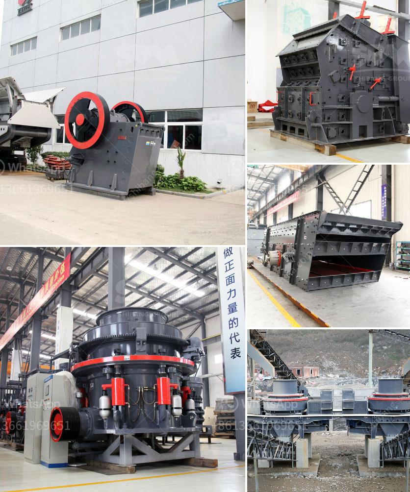

<h3>jaw crusher and impact crusher made in japan</h3>
When it comes to crushing equipment, there are a variety of options available in the market. Two popular choices are jaw crushers and impact crushers. These machines are similar in many ways, but they have distinct differences that make them suitable for different applications. In Japan, both jaw crushers and impact crushers are commonly used in the construction and mining industries. Let's explore the features and advantages of these machines in more detail.

Jaw crushers, also known as primary crushers, are designed to efficiently break down large rocks into smaller stones. They consist of a fixed jaw and a moving jaw, which create a V-shaped cavity. The movable jaw reciprocates, crushing the material against the stationary jaw. This continuous squeezing and releasing action produces a compressive force, reducing the size of the rocks.

One of the notable features of jaw crushers is their ability to handle a wide range of materials, including hard stones, ores, and recycled concrete. They are known for their high production capacity and reliability. Additionally, jaw crushers offer a good reduction ratio, which means they can efficiently crush the material to the desired size.

On the other hand, impact crushers utilize the principle of impact crushing. As the name suggests, the material is subjected to a high-speed impact from the hammers or blow bars installed on the rotor. The incoming feed is hit by the fast-moving blow bars, which cause it to break and disperse upon impact. The material then falls onto a secondary curtain, where it undergoes another impact. This process repeats until the desired size is achieved.

Impact crushers provide efficient crushing in a single pass and are particularly suitable for crushing softer materials such as limestone and gypsum. They excel in applications where high reduction ratios and cubicity are required. Moreover, they offer better control over the output size, making them ideal for producing aggregates for construction purposes.

In terms of maintenance, both jaw crushers and impact crushers require regular inspections and lubrication to ensure their optimal performance. However, jaw crushers tend to have simpler structures and fewer moving parts, making them easier to maintain. Impact crushers, on the other hand, have more complex designs and require more frequent inspection of the wearing parts.

When it comes to choosing between a jaw crusher and an impact crusher made in Japan, the decision largely depends on the specific needs of the project. If the material is hard and abrasive, jaw crushers are the better choice as they can handle large feed sizes and provide a good reduction ratio. However, if the project requires high-quality cubical aggregates or the material is relatively soft, impact crushers may be more suitable.

Japanese-made jaw crushers and impact crushers are known for their robust construction, reliability, and advanced technologies. They are highly regarded in the industry for their superior crushing capabilities, efficiency, and longevity. Furthermore, many Japanese manufacturers offer excellent after-sales support and spare parts availability, ensuring the smooth operation and longevity of these machines.

In conclusion, both jaw crushers and impact crushers made in Japan are reliable and efficient crushing machines. Choosing between them depends on the specific requirements and characteristics of the material being processed. With proper maintenance and care, these machines can provide years of reliable service, contributing to the success of various construction and mining projects.
<h3>Contact us</h3><ul><li><strong>Whatsapp:&nbsp;<a href="https://wa.me/8613661969651">+8613661969651</a></strong></li><li><a href="https://swt.shibang-china.com/?git&amp;zhl&amp;jaw crusher and impact crusher made in japan"><strong>Online Service(chat now)</strong></a></li></ul><h3>Related</h3><ul><li><a href='gold mining equipment stores in tanzania.md'>gold mining equipment stores in tanzania</a></li><li><a href='salcu powder washing machine.md'>salcu powder washing machine</a></li><li><a href='stone quarries south africa.md'>stone quarries south africa</a></li><li><a href='concrete jaw crusher.md'>concrete jaw crusher</a></li><li><a href='used sand wash plant for sale.md'>used sand wash plant for sale</a></li></ul>