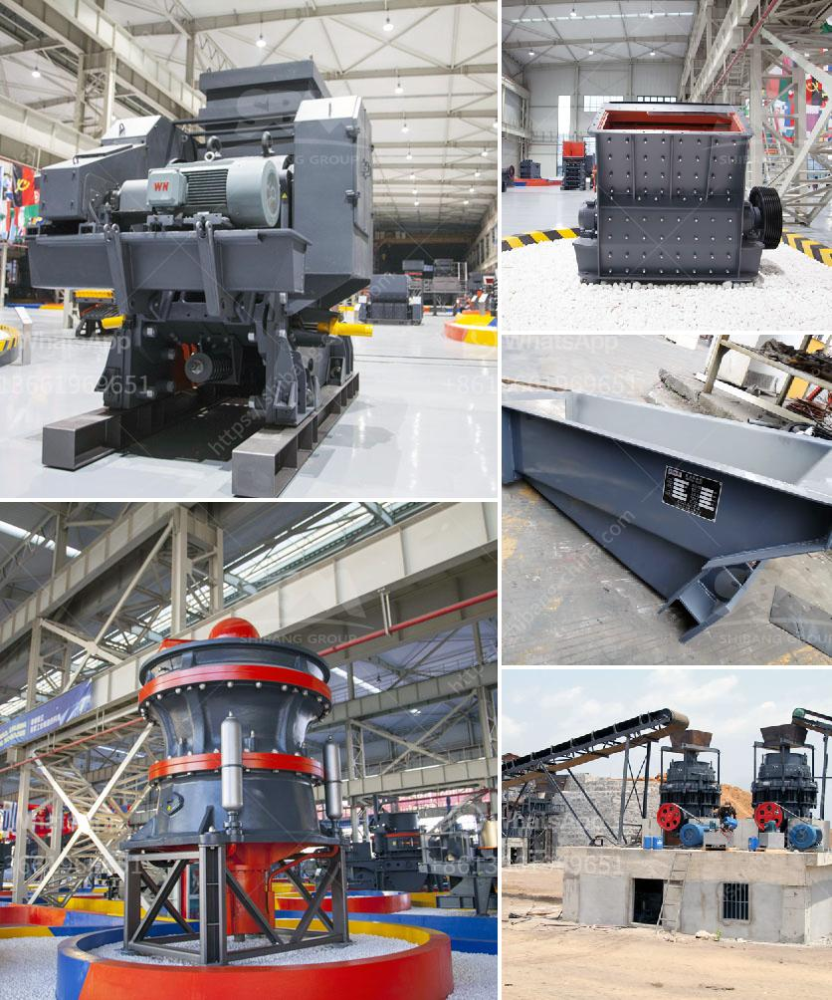

<h3>jaw crusher crusher china</h3>
The jaw crusher is a widely used machine in the mining industry, and it has been proven to be efficient and reliable in processing materials like hard and abrasive stones, granite and ores. The crusher mainly consists of two jaw plates, which are made from high-quality cast manganese steel.

One jaw plate is fixed, while the other moves back and forth to crush the materials. The movement of the jaw plate is controlled by an eccentric shaft that is driven by a motor. This design allows the crusher to efficiently crush large rocks into smaller sizes.

China is known for its advanced technology and manufacturing capabilities, and many jaw crusher manufacturers in China are committed to providing high-quality products and excellent services. They have advanced production facilities, skilled workers, and strict quality control systems to ensure the performance and durability of their crushers.

In addition, Chinese jaw crushers are also cost-effective compared to crushers made in other countries. With the same specifications, a jaw crusher made in China can save a lot of money on purchasing and maintenance costs. This is because the Chinese manufacturers can produce these machines at a lower cost due to their lower labor and raw material costs.

Furthermore, many Chinese jaw crusher manufacturers offer customized solutions for different customer requirements. They can design the crusher according to the specific needs of the customer, such as the capacity, feeding size, and discharge size. With such flexibility, customers can find the right jaw crusher that meets their specific requirements.

In conclusion, the jaw crusher made in China is a cost-effective and reliable option for crushing materials. It provides efficient performance and high-quality end products. With the advanced technology and manufacturing capabilities in China, customers can find the right jaw crusher that suits their needs.
<h3>Contact us</h3><ul><li><strong>Whatsapp:&nbsp;<a href="https://wa.me/8613661969651">+8613661969651</a></strong></li><li><a href="https://swt.shibang-china.com/?git&amp;zhl&amp;jaw crusher crusher china"><strong>Online Service(chat now)</strong></a></li></ul><h3>Related</h3><ul><li><a href='coal wash plant indonesia.md'>coal wash plant indonesia</a></li><li><a href='mobile stone crushers south africa.md'>mobile stone crushers south africa</a></li><li><a href='used ball mills in india.md'>used ball mills in india</a></li><li><a href='magnetita mineral cribado cantera planta trituradora.md'>magnetita mineral cribado cantera planta trituradora</a></li><li><a href='crusher prices stone crusher primary and secondary.md'>crusher prices stone crusher primary and secondary</a></li></ul>