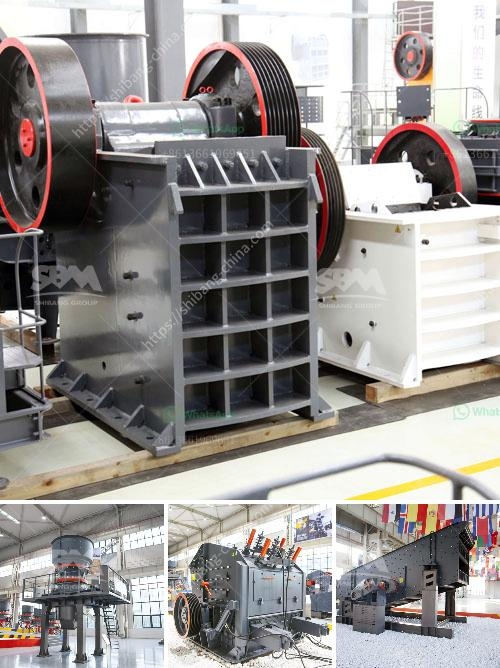

<h3>jaw crusher for sale in auction</h3>
A jaw crusher is a primary crusher used in mining and ore processing plants. It reduces large size rocks or ore by placing the rock into compression. The compression force causes the rock to break down into smaller pieces that can then be processed further. Jaw crushers are known for their efficiency, durability, and reliability, making them a popular choice for crushing applications.

For those in the market for a jaw crusher, the opportunity to acquire one through an auction can be a great option. Auctions provide a unique buying experience that allows buyers to potentially find great deals on used equipment. Jaw crushers that are up for auction are often well-maintained, reliable machines that have been used in various industries, such as mining, construction, and demolition.

One of the benefits of purchasing a jaw crusher through an auction is the potential for cost savings. Auctions often attract competitive bidding, which can drive down the final sale price. This means that buyers have the chance to secure a high-quality jaw crusher at a fraction of its market value.

Another advantage of buying a jaw crusher in an auction is the wide selection available. Auctions feature a diverse range of equipment from various manufacturers, giving buyers the opportunity to compare different models and choose the one that best suits their needs. This means that buyers can find jaw crushers with different specifications, sizes, and capacities to match their specific requirements.

Before participating in a jaw crusher auction, buyers should do their due diligence to ensure they fully understand the condition and specifications of the equipment being sold. It is essential to inspect the jaw crusher thoroughly, checking for any signs of wear, damage, or mechanical issues. Additionally, buyers should familiarize themselves with the auction terms and conditions to understand the bidding process and any applicable fees.

Overall, purchasing a jaw crusher through an auction can be a fantastic opportunity for buyers. The potential for cost savings, the wide selection of equipment available, and the opportunity to secure a reliable machine make auctions an attractive option. However, buyers should exercise caution and conduct proper research before participating in an auction to ensure they make an informed decision.

In conclusion, a jaw crusher for sale in an auction can provide buyers with a chance to find a high-quality, well-maintained machine at a lower price. The competitive bidding process and diverse selection of equipment make auctions an excellent option for those in the market for a jaw crusher. However, buyers should conduct proper inspections and research to ensure they make a wise investment. With the right approach, an auction can be a great opportunity to find the perfect jaw crusher for mining, construction, or other crushing applications.
<h3>Contact us</h3><ul><li><strong>Whatsapp:&nbsp;<a href="https://wa.me/8613661969651">+8613661969651</a></strong></li><li><a href="https://swt.shibang-china.com/?git&amp;zhl&amp;jaw crusher for sale in auction"><strong>Online Service(chat now)</strong></a></li></ul><h3>Related</h3><ul><li><a href='limestone ball mill in egypt.md'>limestone ball mill in egypt</a></li><li><a href='aggregates crusher cebu.md'>aggregates crusher cebu</a></li><li><a href='pine cone coal manufacturing machinery.md'>pine cone coal manufacturing machinery</a></li><li><a href='plamnta mobile stone crusher.md'>plamnta mobile stone crusher</a></li><li><a href='used toner powder making machine price.md'>used toner powder making machine price</a></li></ul>