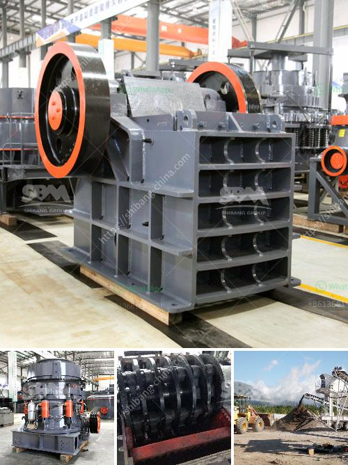

<h3>jaw crusher for sale in philippines</h3>
Jaw crusher, also known as the tiger mouth, has been widely used in mining, metallurgy, construction, road, railway, water conservancy and other industries. It is one of the most commonly used crushing equipment in the Philippines. The jaw crusher is used for crushing various materials, such as granite, cobblestone, basalt, limestone, quartzite, marble, iron ore, coal, and other minerals.

As a primary crushing equipment, the jaw crusher has a wide range of applications. It is suitable for crushing various ores and bulk materials in mining, smelting, building materials, highways, railways, water conservancy, and chemical industries. With various models and specifications, the jaw crusher for sale in Philippines is suitable for crushing materials with compressive strength not exceeding 320MPa.

Compared with the traditional jaw crusher, the jaw crusher for sale in Philippines is more environmentally friendly. In terms of noise reduction, the noise of the machine is reduced by more than 35dB, which effectively reduces noise pollution. In terms of dust prevention, the equipment is equipped with a dustproof cover and a water spraying device, which can effectively control dust and protect the environment.

In addition, the jaw crusher for sale in Philippines has unique advantages in the operation process. The crushing chamber is deep and no dead zone, improving the feeding capacity and output. The crushing ratio is large and the particle size of the finished product is uniform. The adjustment of the discharge port is convenient and quick, which can meet different production requirements.

With the continuous development of the construction industry and the overall improvement of living standards, the demand for crushers in the Philippines is increasing. For customers who want to purchase jaw crushers, the jaw crusher for sale in Philippines is undoubtedly a good choice. A large-scale manufacturer with many years of production experience, providing high quality products, and affordable prices, is also a good reference for customers to buy equipment.
<h3>Contact us</h3><ul><li><strong>Whatsapp:&nbsp;<a href="https://wa.me/8613661969651">+8613661969651</a></strong></li><li><a href="https://swt.shibang-china.com/?git&amp;zhl&amp;jaw crusher for sale in philippines"><strong>Online Service(chat now)</strong></a></li></ul><h3>Related</h3><ul><li><a href='stone crushing quarry works with conveyor belt.md'>stone crushing quarry works with conveyor belt</a></li><li><a href='stone crusher for sale in south philippines.md'>stone crusher for sale in south philippines</a></li><li><a href='crushing plant in lahore.md'>crushing plant in lahore</a></li><li><a href='wet ball mills manufacturers.md'>wet ball mills manufacturers</a></li><li><a href='gypsum grinding machine suppliers.md'>gypsum grinding machine suppliers</a></li></ul>