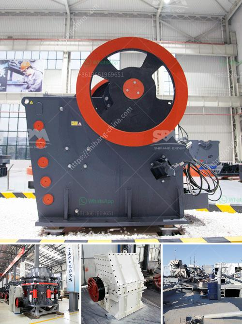

<h3>jaw crusher for sale kenya</h3>
Kenya is the largest economy in East Africa and the seventh largest in Africa, making it an attractive destination for foreign investors. With steady economic growth and a lucrative market, selling jaw crushers is a promising business opportunity in Kenya.

A jaw crusher, also known as a toggle crusher, is specially designed for reducing large rocks into smaller particles. It is widely used in quarries, ore mining, and construction waste recycling. The crushing mechanism of jaw crushers involves the use of a fixed jaw and a movable jaw, both squeezing the rocks to reduce their size.

The demand for aggregate materials for construction projects is high in Kenya. As the construction industry continues to grow, the need for high-quality rocks increases. This creates an excellent market for jaw crushers as they are essential equipment for crushing and processing the rocks.

When purchasing a jaw crusher for sale in Kenya, it is important to consider various factors. Firstly, the quality and durability of the machine are crucial to ensure its long-term performance. A reliable jaw crusher should be made from high-quality materials and have undergone rigorous testing to withstand the harsh conditions of the Kenyan environment.

Additionally, the jaw crusher should have a high production capacity and be able to process a wide range of materials. This versatility allows operators to adjust the size of the output material according to their needs. Furthermore, a user-friendly design and easy maintenance features are desirable for efficient operation and reduced downtime.

Finding a reputable supplier of jaw crushers in Kenya is essential to ensure the best value for your investment. Look for suppliers with a proven track record, positive customer reviews, and excellent after-sales service. A reliable supplier will provide comprehensive support and offer warranty options for their products.

In conclusion, the jaw crusher market in Kenya is booming due to the strong construction industry and high demand for aggregate materials. Investing in a jaw crusher for sale is a wise choice for entrepreneurs looking to tap into this lucrative market. However, careful consideration of the machine's quality, performance, and supplier reputation is essential to make a successful purchase.
<h3>Contact us</h3><ul><li><strong>Whatsapp:&nbsp;<a href="https://wa.me/8613661969651">+8613661969651</a></strong></li><li><a href="https://swt.shibang-china.com/?git&amp;zhl&amp;jaw crusher for sale kenya"><strong>Online Service(chat now)</strong></a></li></ul><h3>Related</h3><ul><li><a href='jaw crushers zimbabwe.md'>jaw crushers zimbabwe</a></li><li><a href='mobile stone crusher machine europa.md'>mobile stone crusher machine europa</a></li><li><a href='renta de cribas vibratorias en mexico.md'>renta de cribas vibratorias en mexico</a></li><li><a href='crushing plant supplier.md'>crushing plant supplier</a></li><li><a href='stone quarries south africa.md'>stone quarries south africa</a></li></ul>