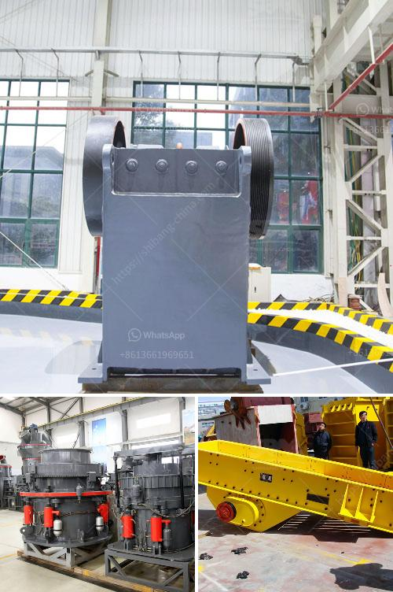

<h3>jaw crusher in uzbekistan</h3>
The jaw crusher in Uzbekistan has been designed for the processing of minerals, ores, and other bulk materials in construction projects and mining industry. The jaw crushers are used in various industries such as construction, metallurgy, mining, and many others. The powerful and reliable jaw crushers are known for their efficiency and profitability.

The jaw crusher in Uzbekistan is widely used for crushing various materials like stone, granite, trap rock, coke, coal, manganese ore, iron ore, emery, fused aluminum, oxide, fused calcium carbide, lime stone, quartzite, alloys, etc. The jaw crusher is capable of crushing rock with a compressive strength of 320 MPa to a size and shape suitable for secondary crushing. It is mainly used to crush various hard or soft materials and widely applied in fields like metallurgy, mining, dust removal equipment, construction, and cement-feeding equipment.

The jaw crusher has a wide range of applications, as it is suited for various materials with a compressive strength of up to 320 MPa. It can be used for primary crushing and medium crushing of materials such as granite, limestone, sandstone, basalt, shale, bluestone, and even iron ore. The capacity of the jaw crusher for sale in Uzbekistan is 3-13 t/h.

The jaw crusher in Uzbekistan is mainly composed of a crushing chamber, a supporting frame assembly, a discharge opening adjusting device, and a driving device. Its specific features are as follows:

In conclusion, the jaw crusher in Uzbekistan is an essential piece of equipment in quarrying and mining activities. It is economical and efficient, widely used for different types of materials with a compressive strength of up to 320 MPa. The jaw crusher is durable and reliable due to its robust construction.
<h3>Contact us</h3><ul><li><strong>Whatsapp:&nbsp;<a href="https://wa.me/8613661969651">+8613661969651</a></strong></li><li><a href="https://swt.shibang-china.com/?git&amp;zhl&amp;jaw crusher in uzbekistan"><strong>Online Service(chat now)</strong></a></li></ul><h3>Related</h3><ul><li><a href='jaw crusher terminator.md'>jaw crusher terminator</a></li><li><a href='coal pulverizing mills.md'>coal pulverizing mills</a></li><li><a href='gold mining equipment manufacturers in china.md'>gold mining equipment manufacturers in china</a></li><li><a href='kaolin processing plant.md'>kaolin processing plant</a></li><li><a href='south africa gold processing equipment.md'>south africa gold processing equipment</a></li></ul>