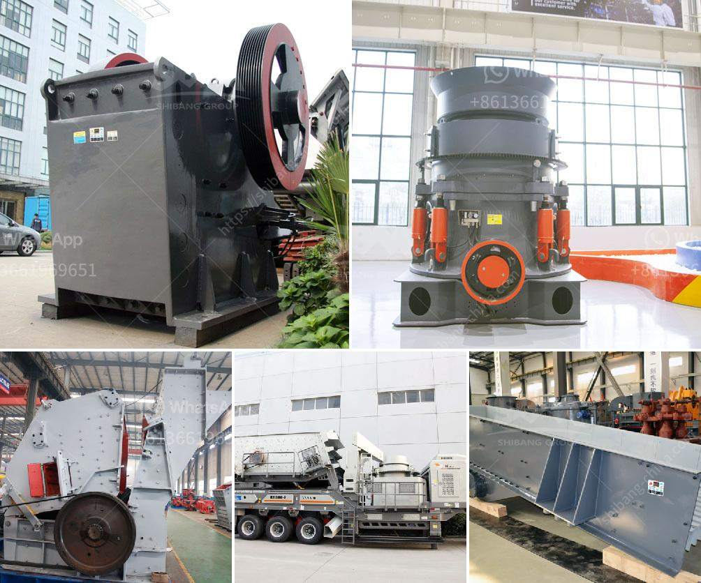

<h3>jaw crusher malaysia</h3>
A jaw crusher is a device that helps in crushing large rocks into smaller pieces. It is commonly used in construction sites and mining industry to crush stones into gravel or rock dust. This machine works by using compressive force to crush the rocks. It is used widely in mining and metallurgical industries, highway construction materials, railway construction, waste management mechanisms, and even in many other applications.

In Malaysia, jaw crusher is the most commonly used primary crushing equipment. It is essential because it helps reduce the size of the rocks that are needed for further use or for any construction project. As the name suggests, a jaw crusher use jaws to crush stones in various sizes and shapes.

One of the key features of a jaw crusher is the ability to change the discharge size. This feature helps in controlling the final product size as per the specific requirements of customers. The adjustable gap ensures that the final product is uniform in size, allowing it to be used effectively in various applications.

The jaw crusher is designed with a stationary jaw plate and a moving jaw plate that creates a V-shaped cavity. The movable jaw plate moves back and forth against the stationary jaw plate, compressing the rocks in the cavity. This repetitive motion crushes the rocks into smaller sizes.

In Malaysia, many industries rely on jaw crushers for their daily operations. For instance, the mining industry heavily relies on jaw crushers to crush ore for further processing. Steel mills often require jaw crushers to reduce the size of iron ore into manageable sizes. Moreover, the construction industry in Malaysia uses jaw crushers to break down large stones for construction purposes.

With Malaysia's growing infrastructure projects, the demand for jaw crushers is expected to rise significantly. The government's focus on infrastructure development, such as the construction of highways, bridges, and residential buildings, will directly benefit jaw crusher manufacturers and suppliers in the country.

In recent years, the technological advancements in jaw crusher design and engineering have made these machines even more efficient and durable. Manufacturers have incorporated features like hydraulic systems, adjustable settings, and improved bearing designs to ensure smooth operation and extended durability. These advancements have not only increased the efficiency of jaw crushers but also reduced maintenance costs for operators.

Furthermore, jaw crusher manufacturers in Malaysia offer a wide range of jaw crusher sizes for varying production capacities. Customers can choose the right-sized jaw crusher based on their specific needs and requirements. This flexibility allows businesses to choose the most suitable machine for their operations, ensuring maximum productivity and cost-effectiveness.

In conclusion, jaw crushers are essential equipment in Malaysia's construction and mining industries. They play a crucial role in reducing the size of stones and rocks, making them suitable for various applications. With Malaysia's growing infrastructure projects, the demand for jaw crushers is expected to increase significantly. Manufacturers have responded to this demand by improving the design and engineering of jaw crushers, making them more efficient and durable. This makes jaw crushers a reliable and indispensable equipment for any construction site or mining operation.
<h3>Contact us</h3><ul><li><strong>Whatsapp:&nbsp;<a href="https://wa.me/8613661969651">+8613661969651</a></strong></li><li><a href="https://swt.shibang-china.com/?git&amp;zhl&amp;jaw crusher malaysia"><strong>Online Service(chat now)</strong></a></li></ul><h3>Related</h3><ul><li><a href='mini concrete crusher portable for rent.md'>mini concrete crusher portable for rent</a></li><li><a href='copper grind powder mill machine.md'>copper grind powder mill machine</a></li><li><a href='grinding size of bentonite crusher.md'>grinding size of bentonite crusher</a></li><li><a href='salcu powder washing machine.md'>salcu powder washing machine</a></li><li><a href='gypsum ceiling plant price in pakistan.md'>gypsum ceiling plant price in pakistan</a></li></ul>