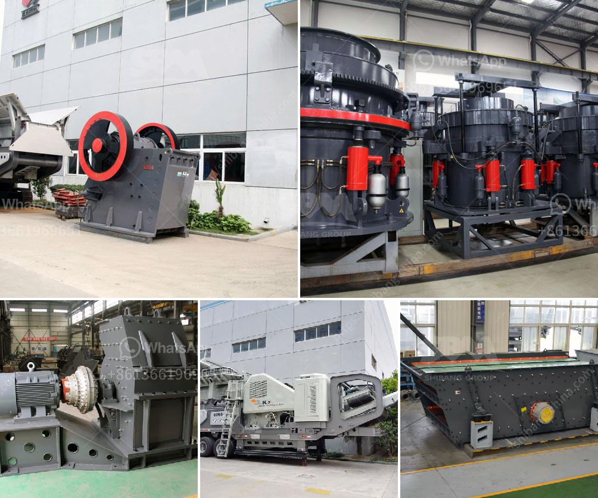

<h3>jaw crusher manufacturers</h3>
Jaw crushers are one of the most commonly used crushers due to their ability to crush all kinds of materials of any hardness, as well as their low-cost operation and easy maintenance. With their wide range of features, jaw crushers have become a staple in many industries where crushing is an essential process. However, finding reliable jaw crusher manufacturers to purchase from can be a daunting task.

When selecting a jaw crusher manufacturer, it is essential to ensure that they provide reliable and efficient machinery. This is crucial for maximizing productivity and ensuring that the crushing process runs smoothly. A reliable manufacturer will offer high-quality machines that are designed to withstand the harshest conditions and provide consistent performance.

Efficiency is another important factor when choosing a jaw crusher manufacturer. A high-efficiency jaw crusher can save you time and money. It is essential to find a manufacturer that offers energy-efficient machines, as this will result in significant cost savings in the long run. The efficiency of a jaw crusher is determined by its design, the materials it is made from, and its operating parameters.

Some well-known jaw crusher manufacturers in the market include Sandvik, Metso, and Terex. They have been providing reliable and efficient machinery for the mining, construction, and recycling industries for many years. These manufacturers are known for their innovative designs and technology, which allows for high performance and efficient crushing.

In conclusion, when searching for jaw crusher manufacturers, it is crucial to find a reliable and efficient company that offers high-quality machines. This will ensure that your crushing process is efficient, productive, and cost-effective. Consider factors such as reliability, efficiency, and the manufacturer's reputation before making a purchase. By doing so, you can ensure that you get the most out of your investment and maximize your productivity.
<h3>Contact us</h3><ul><li><strong>Whatsapp:&nbsp;<a href="https://wa.me/8613661969651">+8613661969651</a></strong></li><li><a href="https://swt.shibang-china.com/?git&amp;zhl&amp;jaw crusher manufacturers"><strong>Online Service(chat now)</strong></a></li></ul><h3>Related</h3><ul><li><a href='vertical impact crusher.md'>vertical impact crusher</a></li><li><a href='rock screening plants usa.md'>rock screening plants usa</a></li><li><a href='listing price tons per hour screw conveyor.md'>listing price tons per hour screw conveyor</a></li><li><a href='iron ore beneficiation proposal.md'>iron ore beneficiation proposal</a></li><li><a href='ball mill ball mill factories.md'>ball mill ball mill factories</a></li></ul>