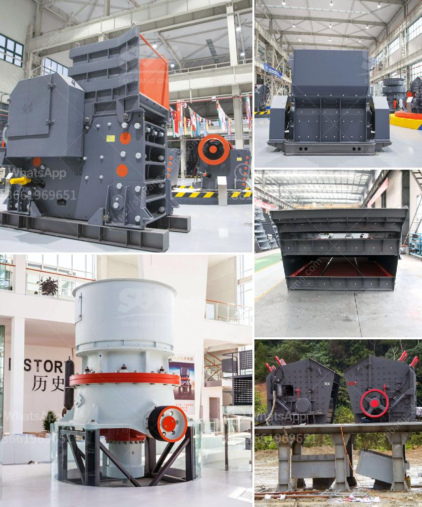

<h3>jaw crusher part diagram</h3>
A jaw crusher's flywheel, toggle plates, pitman, eccentric shaft, and driving motor generate the crushing action and provide the energy needed to break the material into smaller sizes. As the jaw crusher's structure diagram shows, the main components of a jaw crusher include the feed mechanism, the eccentric shaft, the flywheel, the frame, and the adjusting mechanism.

The feed mechanism, also known as the feeding hopper, is responsible for receiving and transferring the material into the jaw crusher. It has an adjustable bottom plate for optimal control over the size of the incoming material.

The eccentric shaft is a crucial component that transfers the motion from the motor to the jaw plate. It has a circular shape and is mounted at the center of the flywheel. As the motor rotates, it generates a vertical and horizontal motion, causing the jaw plate to move reciprocally and crush the materials against the fixed jaw plate.

The flywheel is a heavy metal disk that stores the rotational energy of the motor, which helps in maintaining sufficient energy to crush the material. It is typically made of cast iron and is connected to the eccentric shaft through a V-belt.

The frame is the main structure of the jaw crusher, responsible for supporting all the components and ensuring their proper alignment. It is usually made of steel and reinforced with vertical and horizontal plates to provide strength and stability.

Lastly, the adjusting mechanism allows the user to control the size of the crushed material by adjusting the distance between the jaw plates. It typically consists of a toggle plate, which connects the movable jaw to the toggle seat, and tension rods that apply pressure to bring the stationary jaw plate closer to the movable jaw.

In conclusion, a jaw crusher's part diagram includes essential components such as the feed mechanism, eccentric shaft, flywheel, frame, and adjusting mechanism. Understanding the function of each component can help in comprehending the overall working principle of a jaw crusher, leading to efficient and effective crushing operations.
<h3>Contact us</h3><ul><li><strong>Whatsapp:&nbsp;<a href="https://wa.me/8613661969651">+8613661969651</a></strong></li><li><a href="https://swt.shibang-china.com/?git&amp;zhl&amp;jaw crusher part diagram"><strong>Online Service(chat now)</strong></a></li></ul><h3>Related</h3><ul><li><a href='jaw crusher manufacturers.md'>jaw crusher manufacturers</a></li><li><a href='m sand manufacturing project report.md'>m sand manufacturing project report</a></li><li><a href='coal vertical roller mill.md'>coal vertical roller mill</a></li><li><a href='rotary kiln design calculation pdf.md'>rotary kiln design calculation pdf</a></li><li><a href='grinding cost calculation for bm 8 usha mill.md'>grinding cost calculation for bm 8 usha mill</a></li></ul>