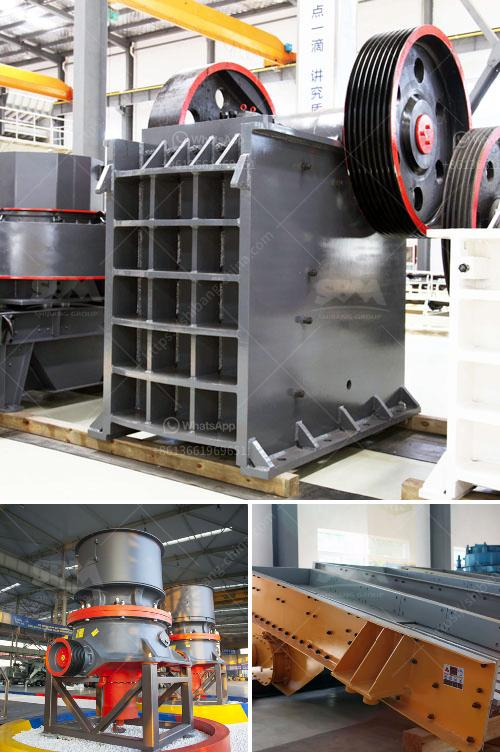

<h3>jaw crusher plant for sale</h3>
With the economy rapidly developing, infrastructure construction and mineral resources are increasing in demand. Therefore, the crusher equipment market is thriving. Jaw crushers are popular equipment that is utilized for breaking down big chunks of rock into manageable pieces. Jaw crushers are widely used in the mining, construction, and recycling industries due to their ability to crush a variety of materials with high efficiency.

In recent years, jaw crusher plants have made a great contribution to the development of mining industry. With years of experience, our products have been sold to over 100 countries, earning a high reputation in the industry. Our jaw crusher plant satisfies the needs of a wide range of customers, such as those involved in the coarse crushing of various hard materials in the mining, metallurgy, building material, highway, railway, water conservancy, and chemical industries.

1. High Return on Investment: The jaw crusher plant for sale is simple in structure, excellent in performance, and low in maintenance, making it an ideal investment option for investors seeking high-return opportunities.

2. Stable Performance and Reliable Production: The jaw crusher plant has a high production efficiency, yet low noise and dust pollution, allowing it to be the perfect choice for many businesses.

3. Easy Operation and Maintenance: The jaw crusher plant is equipped with an overload protection device, reducing the risk of equipment damage. Consisting of an intelligent control system, users can easily operate the entire plant.

4. Wide Range of Applications: The jaw crusher plant is versatile, easy to use and can be quickly adapted to suit various crushing environments. The set-up time is fast, and the equipment can be adjusted according to the size of the material being processed.

5. Environmentally Friendly: The jaw crusher plant is equipped with a water spraying system that effectively controls dust, minimizing potential harm to both the operator and the environment.

Considering these advantages, investing in a jaw crusher plant for sale is a smart decision for businesses looking to expand their production capabilities. Whether you are just starting a new business or are an experienced entrepreneur, having a jaw crusher plant is a good investment choice.

In summary, a jaw crusher plant for sale is mainly used for a variety of rocks or ores with medium hardness, which can be further processed to produce various finished materials. Therefore, it is an economical and reliable choice for customers seeking a simple, efficient, and low-cost crushing equipment.

With our jaw crusher plant, you can efficiently and conveniently crush materials to meet your specific needs. Contact us today to learn more about our jaw crusher plant for sale and find out how it can benefit your business.
<h3>Contact us</h3><ul><li><strong>Whatsapp:&nbsp;<a href="https://wa.me/8613661969651">+8613661969651</a></strong></li><li><a href="https://swt.shibang-china.com/?git&amp;zhl&amp;jaw crusher plant for sale"><strong>Online Service(chat now)</strong></a></li></ul><h3>Related</h3><ul><li><a href='crusher stone manufacturers.md'>crusher stone manufacturers</a></li><li><a href='stone quarrying companies in tanzania.md'>stone quarrying companies in tanzania</a></li><li><a href='granite stones crusher.md'>granite stones crusher</a></li><li><a href='robinson henry roller mills.md'>robinson henry roller mills</a></li><li><a href='manufactures mineral crusher oruro bolivia.md'>manufactures mineral crusher oruro bolivia</a></li></ul>