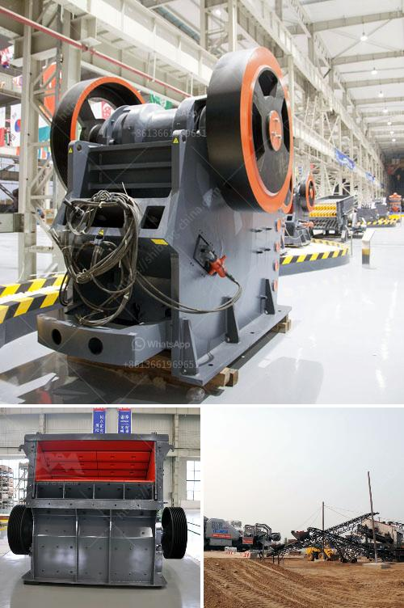

<h3>jaw crusher price saudi</h3>
Saudi Arabia is known for its abundant oil resources. Oil prices are always high in Saudi Arabia, giving the country a stable economy. As a result, the construction industry is booming in the country. One of the most popular construction materials used in Saudi Arabia is the jaw crusher.

Jaw crushers are most commonly used in the mining and construction industry. These machines are used to crush rocks into smaller pieces, making them easier to transport and handle. The right jaw crusher could make construction projects more efficient by reducing the need for heavy machinery and improving the overall productivity of the project.

When considering the purchase of a jaw crusher in Saudi Arabia, price is a key factor to consider. Buyers need to evaluate the maximum feed size the crusher can handle, as well as the processing capacity, to ensure that the output meets their requirements. Other important factors include the material the jaw crusher is made from and the reputation of the manufacturer.

In Saudi Arabia, the prices of jaw crushers are based on the size of the machine. As the size increases, the price also increases. Larger machines are typically more expensive, but they also offer higher processing capacities, which can be beneficial for large construction projects.

On average, the price of a jaw crusher in Saudi Arabia is around $350,000. The larger machines can cost as much as $700,000. However, these machines are built to be durable and reliable, so they are worth the investment.

When choosing a jaw crusher, it is important to consider the reputation of the manufacturer. Some manufacturers may offer lower prices, but their machines may not be as reliable or have a shorter lifespan. It is important to choose a manufacturer with a good reputation and positive customer reviews.

In conclusion, when looking for a jaw crusher in Saudi Arabia, it is important to consider the price, processing capacity, and reputation of the manufacturer. Jaw crushers are essential for the construction industry in Saudi Arabia, providing efficient crushing of rocks and reducing the need for heavy machinery. While the price of a jaw crusher may seem high, it is an investment that pays off in the long run, ensuring productivity and efficiency in construction projects.
<h3>Contact us</h3><ul><li><strong>Whatsapp:&nbsp;<a href="https://wa.me/8613661969651">+8613661969651</a></strong></li><li><a href="https://swt.shibang-china.com/?git&amp;zhl&amp;jaw crusher price saudi"><strong>Online Service(chat now)</strong></a></li></ul><h3>Related</h3><ul><li><a href='gold hammer mill used for sale in zimbabwe.md'>gold hammer mill used for sale in zimbabwe</a></li><li><a href='hammer crusher parameters introduced in detail.md'>hammer crusher parameters introduced in detail</a></li><li><a href='quartz crushing plant.md'>quartz crushing plant</a></li><li><a href='coal pulverizer machine hammer.md'>coal pulverizer machine hammer</a></li><li><a href='gold mining company tanzania.md'>gold mining company tanzania</a></li></ul>