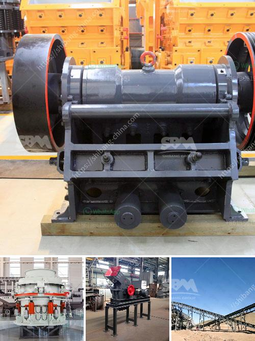

<h3>jaw crusher private sale south africa</h3>
In South Africa, the private sale of jaw crushers is booming. With the rapid development of the country's infrastructure, the demand for jaw crushers is growing by the day. This is mainly attributed to the increasing number of road construction projects, housing developments, and other infrastructure projects that require high-quality aggregates.

A jaw crusher, also known as a toggle crusher, is a machine used to break up hard materials into smaller pieces. It is predominantly used in the mining and construction industries for crushing various stones and rocks with compressive strength less than 320 MPa. The jaw crusher has a fixed jaw and a moving jaw, which moves back and forth to crush the material into smaller sizes.

The private sale of jaw crushers in South Africa is a growing industry. This is due to the fact that the mining industry is on the rise, which means there is a huge demand for these machines. Additionally, the construction industry is also flourishing, creating a need for high-quality aggregates.

Private sellers offer a wide range of jaw crushers in South Africa. This variety allows buyers to choose machines that are suitable for their specific needs. Private sales also offer competitive prices, as sellers are often motivated to sell quickly and efficiently.

When buying a jaw crusher from a private seller in South Africa, there are a few factors to consider. Firstly, it is important to inspect the machine thoroughly before purchase. This includes checking the condition of the engine, as well as the overall structure and components of the jaw crusher. It is also recommended to request a test run to ensure that the machine is in good working order.

Another important consideration is the warranty and after-sales service provided by the seller. A trustworthy seller should offer some form of warranty or guarantee on the jaw crusher, as well as provide assistance with any technical issues that may arise after the purchase.

It is also advisable to research the reputation and track record of the private seller before making a purchase. This can be done by checking online reviews or asking for references from previous customers. A reputable seller will have positive feedback and a history of successful transactions.

Overall, the private sale of jaw crushers in South Africa provides buyers with a great opportunity to find high-quality machines at competitive prices. The growing demand for these crushers in the mining and construction industries ensures that there is a wide variety of options available. By conducting proper research and inspecting the machine before purchase, buyers can find a reliable and efficient jaw crusher that meets their needs.
<h3>Contact us</h3><ul><li><strong>Whatsapp:&nbsp;<a href="https://wa.me/8613661969651">+8613661969651</a></strong></li><li><a href="https://swt.shibang-china.com/?git&amp;zhl&amp;jaw crusher private sale south africa"><strong>Online Service(chat now)</strong></a></li></ul><h3>Related</h3><ul><li><a href='ultra fine powder grinding machine.md'>ultra fine powder grinding machine</a></li><li><a href='limestone crushing machine supplier.md'>limestone crushing machine supplier</a></li><li><a href='crusher price south africa.md'>crusher price south africa</a></li><li><a href='mica crusher production plants.md'>mica crusher production plants</a></li><li><a href='gypsum chromium limestone mining.md'>gypsum chromium limestone mining</a></li></ul>