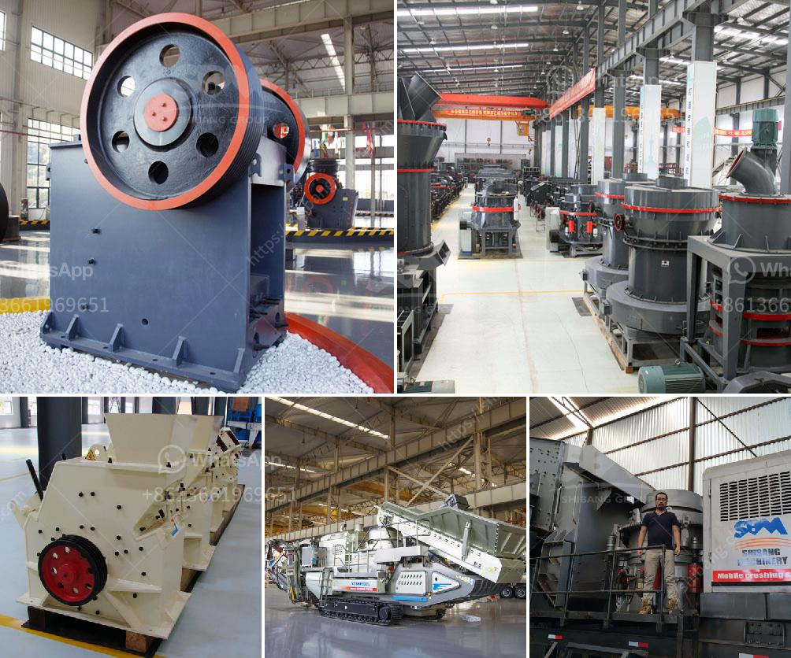

<h3>jaw crusher production line diagram</h3>
Jaw crusher production line diagram is a useful tool for planning and organizing the production of stone crushing plant. This diagram shows how the jaw crusher and other associated equipments are interconnected with each other. It is a guide to understand how the machines operate and how they are interconnected. It is essential to know how each machine operates in order to properly utilize them and achieve the desired output.

The jaw crusher production line diagram can be used as a representation of the entire production line, utilizing the jaw crusher as the primary crushing equipment. The materials are conveyed into the jaw crusher through the vibrating feeder. After the primary crushing process, the crushed material is conveyed to the impact crusher through the belt conveyor for further crushing. Then, the materials are screened by the vibrating screen. The finished products are conveyed into the finished product stacker through the belt conveyor.

The jaw crusher plays a significant role in the production line, as it is responsible for the primary crushing process. The conveyor belt system is the connecting link between the crushers and the vibrating screens. Therefore, the efficiency and reliability of the conveyor belt system are important for the overall performance of the production line. The vibrating screen is responsible for the screening process, which separates the materials into different sizes.

In conclusion, the jaw crusher production line diagram is a guide for the proper utilization of the jaw crusher and the support equipment accompanying it. This diagram represents the configuration of a stone crusher production line and shows how the equipment operates. The knowledge gained from such a diagram can ensure that the utilization of the jaw crusher is optimized and productivity is maximized.
<h3>Contact us</h3><ul><li><strong>Whatsapp:&nbsp;<a href="https://wa.me/8613661969651">+8613661969651</a></strong></li><li><a href="https://swt.shibang-china.com/?git&amp;zhl&amp;jaw crusher production line diagram"><strong>Online Service(chat now)</strong></a></li></ul><h3>Related</h3><ul><li><a href='screen crusher for sale.md'>screen crusher for sale</a></li><li><a href='tons per year gypsum powder production line.md'>tons per year gypsum powder production line</a></li><li><a href='mobile crusher in japan used crusher.md'>mobile crusher in japan used crusher</a></li><li><a href='gold crusher and mill.md'>gold crusher and mill</a></li><li><a href='gypsum beneficiation plant.md'>gypsum beneficiation plant</a></li></ul>