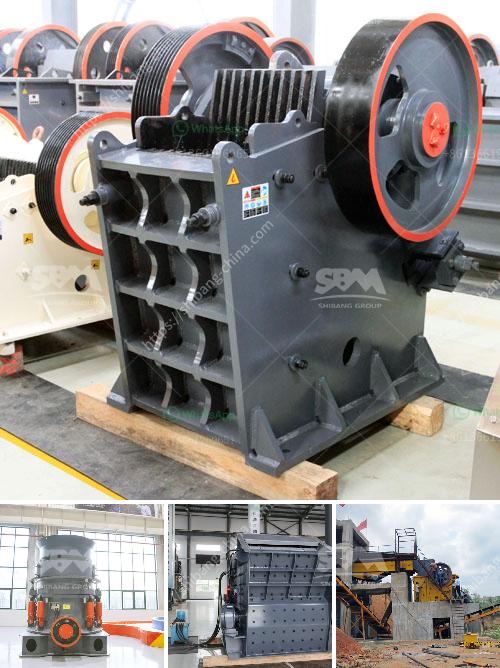

<h3>jaw crusher saudi small capacity</h3>
The jaw crusher is a versatile and powerful crushing machine that is ideal for crushing materials in industries such as mining, quarrying, and recycling. Jaw crushers are added in industries where the materials are hard, abrasive, and extremely challenging to break down.

The small capacity jaw crusher is designed for high productivity in small quarries, mines, and other industrial applications. Suitable for crushing materials such as limestone, granite, and basalt, the small capacity jaw crusher is suitable for reducing the size of small rocks and stones.

With a maximum capacity of around 80-180 tons per hour, this machine is perfect for small-scale crushing operations. It gives operators the flexibility to adjust the size of the material produced, making it ideal for construction projects and smaller quarry operations.

The small capacity jaw crusher is known for its compact size and easy operation. It takes up a minimal amount of space in the processing plant and is easy to transport between sites. This makes it a cost-effective solution for crushing small quantities of materials.

One of the standout features of the small capacity jaw crusher is its powerful crushing ability. The machine uses a fixed jaw plate and a moving jaw plate to crush the material between them. This process is repeated until the desired size is achieved.

The small capacity jaw crusher is equipped with an advanced motor that generates high-quality, efficient power. This ensures smooth and continuous operation, reducing downtime and increasing productivity. The strong and durable construction of the machine ensures long-lasting performance, even in the toughest conditions.

In addition to its powerful crushing capabilities, the small capacity jaw crusher offers easy maintenance. The machine is designed with accessibility in mind, making it easy to access and replace wear parts as needed. This reduces downtime and keeps the machine running at its optimal performance level.

Furthermore, the small capacity jaw crusher is equipped with a range of safety features to protect operators and workers. These include safety guards, emergency stop buttons, and a lockable control panel to prevent unauthorized use of the machine.

In conclusion, the small capacity jaw crusher is an efficient and versatile machine that is ideal for small-scale crushing operations. Its compact size, powerful crushing ability, and easy maintenance make it a perfect choice for industries such as mining, quarrying, and recycling. With its high productivity and low operating costs, the small capacity jaw crusher is a valuable asset to any processing plant.
<h3>Contact us</h3><ul><li><strong>Whatsapp:&nbsp;<a href="https://wa.me/8613661969651">+8613661969651</a></strong></li><li><a href="https://swt.shibang-china.com/?git&amp;zhl&amp;jaw crusher saudi small capacity"><strong>Online Service(chat now)</strong></a></li></ul><h3>Related</h3><ul><li><a href='crusher in pakistan.md'>crusher in pakistan</a></li><li><a href='gold mining equipment from japan.md'>gold mining equipment from japan</a></li><li><a href='diagram of hammer mill.md'>diagram of hammer mill</a></li><li><a href='crushing and screening companies in south africa.md'>crushing and screening companies in south africa</a></li><li><a href='crusher price in nepal.md'>crusher price in nepal</a></li></ul>