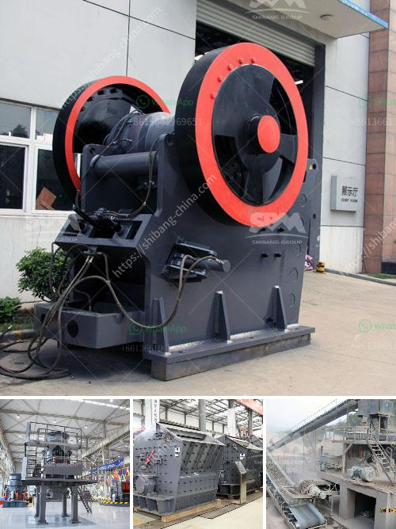

<h3>jaw crusher seller in philippines pakistan</h3>
When it comes to construction and mining projects, the importance of reliable crushing equipment cannot be overlooked. This is why selecting the right crusher seller is crucial. Unfortunately, there are numerous sellers who sell substandard crushers. Therefore, you need to properly research before choosing a jaw crusher seller in the Philippines or Pakistan.

A jaw crusher is commonly used in mining, construction, and recycling industries. These machines have the ability to evenly break down huge rocks into small pieces, effectively reducing the size of the material for further processing and transportation. The proper functioning of a jaw crusher is essential to ensure productivity and efficiency on a project.

In the Philippines and Pakistan, there are many local sellers offering different types of jaw crushers, such as PE, PEX, and HD series crushers. Due to the variety of choices, it is important to determine your exact needs prior to making a purchase. Consider factors such as the type of material you are crushing, the required output size, and the processing capacity.

To find a reliable jaw crusher seller, do thorough research on various sellers available in the market. Look for sellers with a reputable background and a proven track record of delivering quality machinery. Online reviews and customer feedback are great indicators of the seller's reputation. Customer testimonials often provide insight into the reliability, durability, and performance of the equipment.

Additionally, it is essential to determine if the seller provides after-sales support and assistance, such as technical guidance and spare parts availability. A seller that offers comprehensive customer support ensures peace of mind and minimizes downtime, leading to increased productivity and reduced operational costs.

Lastly, compare prices and negotiate the best deal. While it is important to find a reasonably-priced crusher, remember that quality should never be compromised. Invest in a high-quality jaw crusher that promises performance, long life, and value for money.

In conclusion, selecting a reliable jaw crusher seller in the Philippines or Pakistan is crucial for any construction or mining project. Thorough research, considering customer feedback, and assessing after-sales support are imperative before making a purchasing decision. By investing in a high-quality crusher, you can ensure efficient crushing operations and maximize your project's productivity.
<h3>Contact us</h3><ul><li><strong>Whatsapp:&nbsp;<a href="https://wa.me/8613661969651">+8613661969651</a></strong></li><li><a href="https://swt.shibang-china.com/?git&amp;zhl&amp;jaw crusher seller in philippines pakistan"><strong>Online Service(chat now)</strong></a></li></ul><h3>Related</h3><ul><li><a href='calcium carbonate plants in qatar.md'>calcium carbonate plants in qatar</a></li><li><a href='quarry crusher machines for sale.md'>quarry crusher machines for sale</a></li><li><a href='roller mill spaider.md'>roller mill spaider</a></li><li><a href='used stone crusher machine price.md'>used stone crusher machine price</a></li><li><a href='stone crusher hammer crusher.md'>stone crusher hammer crusher</a></li></ul>