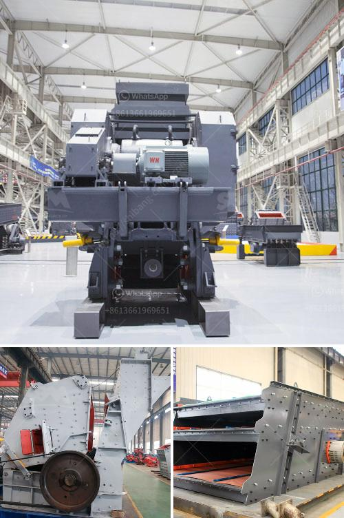

<h3>jaw crusher shanghai</h3>
Jaw crushers are commonly used in the mining and construction industry due to their ability to crush a variety of materials with high strength and hardness. Shanghai is a well-known manufacturer of jaw crushers, regarded for its innovative and efficient design. They have been serving customers with their high-quality machines for generations.

The jaw crusher Shanghai is characterized by its simple structure, robustness, reliability, high crushing ratio, and easy maintenance. These impressive features have contributed to the popularity of the Shanghai jaw crushers among professionals and customers. Today, they are one of the leading jaw crusher suppliers in the industry.

One of the primary advantages of jaw crushers is their ability to crush materials of any hardness. They are particularly suitable for crushing materials with compressive strength up to 320 MPa. This makes them ideal for a wide range of applications, including mining, smelting, building materials, road construction, and chemical industries.

The Shanghai jaw crushers are equipped with a double-wedge adjustment system that contributes to their easy operation. The system allows users to adjust the crushing gap easily, ensuring an efficient and consistent product size. Furthermore, the hydraulic system provides additional convenience, allowing for quick and easy maintenance.

Another notable feature of the Shanghai jaw crushers is their high crushing ratio. This means that the crushers can reduce large rocks into smaller rocks, gravel, or rock dust with minimal energy consumption. The resulting crushed materials can be used for various purposes, including further processing, concrete production, or as aggregates for construction projects.

Moreover, Shanghai jaw crushers are built to last. The robust construction ensures durability, even under the most challenging conditions. This, combined with their reliability, makes them a trusted choice for many professionals in the industry.

In conclusion, the jaw crusher Shanghai is a versatile and efficient crusher machine that can be used for a wide range of applications. It is characterized by its simple structure, reliable operation, high crushing ratio, and easy maintenance. The jaw crusher Shanghai is widely used in the mining and construction industry due to its ability to crush materials of any hardness. It is an ideal choice for crushing large rocks into smaller stones or gravel. With its high-quality products and reliable reputation, Shanghai has become a trusted name in the jaw crusher industry.
<h3>Contact us</h3><ul><li><strong>Whatsapp:&nbsp;<a href="https://wa.me/8613661969651">+8613661969651</a></strong></li><li><a href="https://swt.shibang-china.com/?git&amp;zhl&amp;jaw crusher shanghai"><strong>Online Service(chat now)</strong></a></li></ul><h3>Related</h3><ul><li><a href='kaolin processing equipment.md'>kaolin processing equipment</a></li><li><a href='crusher for quick limestone plant.md'>crusher for quick limestone plant</a></li><li><a href='gypsum manufacturer in ethiopia.md'>gypsum manufacturer in ethiopia</a></li><li><a href='ball mill in ceramic industry.md'>ball mill in ceramic industry</a></li><li><a href='machines for quarrying of stones.md'>machines for quarrying of stones</a></li></ul>