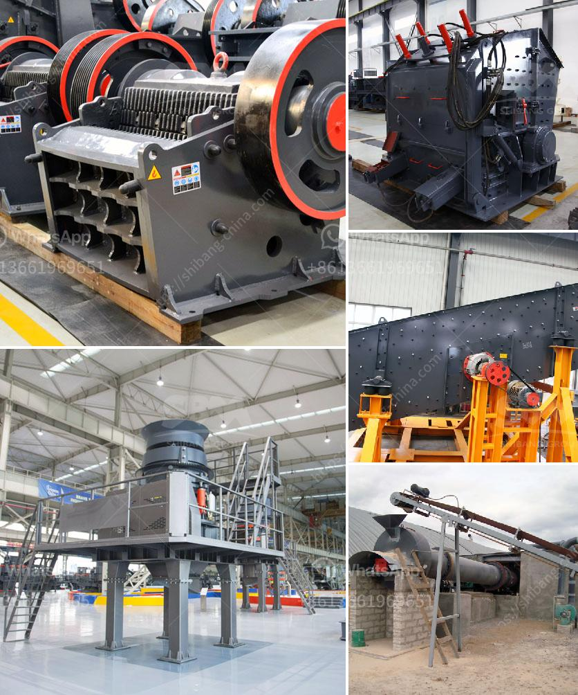

<h3>jaw crusher supplier in philippines</h3>
A jaw crusher supplier in the Philippines is a company that manufactures and sells jaw crushers, commonly known as rock crushers or aggregate crushing equipment. It is mainly used for primary crushing of various ores and bulk materials that are used in various sectors such as mining, construction, building materials, electric power, metallurgy, etc.

In the Philippines, there are many jaw crusher manufacturers and suppliers, thus making it hard to choose a reliable supplier. In order to select a suitable jaw crusher supplier, we need to do some research on the following aspects:

The product quality and performance are the key factors that customers should consider. In this case, the quality and performance of jaw crushers are important for the customers. A jaw crusher supplier with rich experience and good reputation will be more reliable. Jaw crusher supplier in the Philippines will also be more stable due to this, because of a long-term mutual trust and cooperation relationship with their customers.

The manufacturing skills and experience of a jaw crusher supplier in the Philippines is crucial. In order to choose a reliable supplier, buyers should take into account the following factors:

Experience: The supplier should have a strong track record in the industry and have the necessary knowledge and expertise to provide high-quality products and solutions.

Skill: The jaw crusher supplier should be able to provide technical support when necessary, and to train the users and operators of the jaw crushers in order to ensure the correct and efficient operation of the machines.

The supplier's service and support play a crucial role in the buying process and the post-sale satisfaction of the customers. A reliable jaw crusher supplier will provide good after-sale services to protect the interests of customers.

Services: The supplier should provide assistance in installation, commissioning, and training, as well as regular maintenance check-ups and spare parts supply.

Support: The supplier should have a dedicated team of professionals available to provide technical support and address any issues or concerns that may arise.

Of course, the price and delivery time are also important considerations for customers when choosing a jaw crusher supplier in the Philippines. Customers should do a thorough comparison of various suppliers' prices, and choose the one that offers competitive prices without compromising on quality. The supplier should also have a reputation for delivering products on time and meeting customer expectations.

In conclusion, choosing a reliable jaw crusher supplier in the Philippines is an important step to ensuring that your project is successful. It is always best to consult with suppliers and get their opinions about the various machines available and their suitability for your particular project. By considering the factors mentioned above, you can find a supplier that meets your needs and provides you with high-quality jaw crushers.
<h3>Contact us</h3><ul><li><strong>Whatsapp:&nbsp;<a href="https://wa.me/8613661969651">+8613661969651</a></strong></li><li><a href="https://swt.shibang-china.com/?git&amp;zhl&amp;jaw crusher supplier in philippines"><strong>Online Service(chat now)</strong></a></li></ul><h3>Related</h3><ul><li><a href='mini concrete crusher portable for rent.md'>mini concrete crusher portable for rent</a></li><li><a href='russia stone crusher.md'>russia stone crusher</a></li><li><a href='crusher stone manufacturers.md'>crusher stone manufacturers</a></li><li><a href='cost of hammer mills for price.md'>cost of hammer mills for price</a></li><li><a href='suppliers of mining mills in south africa.md'>suppliers of mining mills in south africa</a></li></ul>