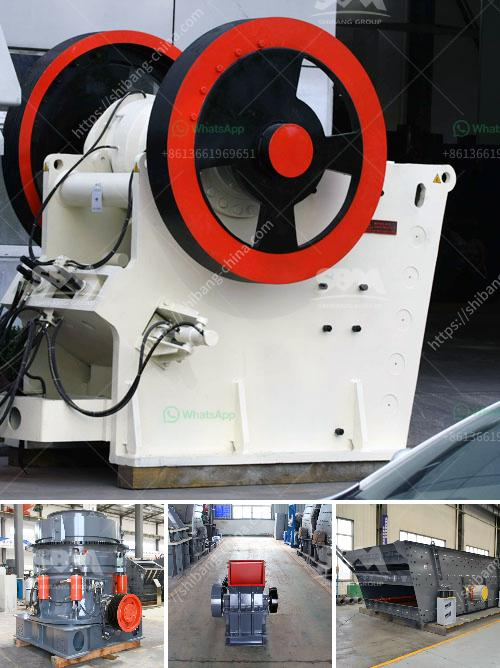

<h3>jaw crusher supplier in the philippines</h3>
A jaw crusher is one of the most commonly used mining equipment in the Philippines. Jaw crusher is used for crushing different sizes of stones and rocks. And, as we all know, each type of jaw crusher has some specific features and specifications, so you can choose the right one for your project.

Jaw crusher is the most common type of crushing equipment in the Philippines because of its simple structure, reliable performance, and easy maintenance. And many projects in the Philippines require such crusher equipment. The market demand for crushing equipment is increasing continuously.

In recent years, the Philippines has witnessed rapid economic development and infrastructure projects have been increasing. So, there is a big demand for jaw crusher for mining equipment in the Philippines. However, how to choose a reliable supplier of jaw crusher equipment in the Philippines?

There are several factors you need to consider when choosing a reliable supplier for jaw crusher in the Philippines. Here are some important tips:

It is important to choose a jaw crusher supplier with a good reputation. A good reputation is usually earned through years of quality products and services. You may check the supplier's reviews online or get recommendations from other people in the industry.

Experience can also be a deciding factor when choosing a reliable jaw crusher supplier. Suppliers with more experience usually have a better understanding of customer needs and can provide more suitable and cost-effective products.

A good supplier should not only focus on selling products but also provide excellent after-sales service. This includes offering installation, maintenance, and repair services. Make sure to check if the supplier can provide these services and if they have a reliable customer support team.

The quality of the jaw crusher is crucial for its performance and longevity. You should check if the supplier uses high-quality materials for manufacturing jaw crushers. Also, make sure to evaluate the technical specifications and features of the jaw crusher to ensure it meets your specific requirements.

Price is always an important factor when choosing any supplier. However, do not compromise on quality for a lower price. Make sure the price is reasonable and competitive in the market. Also, consider the supplier's delivery time to ensure your project timeline can be met.

In conclusion, finding a reliable jaw crusher supplier in the Philippines is not an easy task. You need to take several factors into consideration, including reputation, experience, after-sales service, quality, price, and delivery time. By doing thorough research and evaluation, you can find a supplier that meets your requirements and helps you achieve your project goals.
<h3>Contact us</h3><ul><li><strong>Whatsapp:&nbsp;<a href="https://wa.me/8613661969651">+8613661969651</a></strong></li><li><a href="https://swt.shibang-china.com/?git&amp;zhl&amp;jaw crusher supplier in the philippines"><strong>Online Service(chat now)</strong></a></li></ul><h3>Related</h3><ul><li><a href='cheat gold crusher.md'>cheat gold crusher</a></li><li><a href='screen astec vibrating screen price.md'>screen astec vibrating screen price</a></li><li><a href='quarry plant equipment.md'>quarry plant equipment</a></li><li><a href='silico manganese manufacturing equipment.md'>silico manganese manufacturing equipment</a></li><li><a href='mineral processing plants china.md'>mineral processing plants china</a></li></ul>