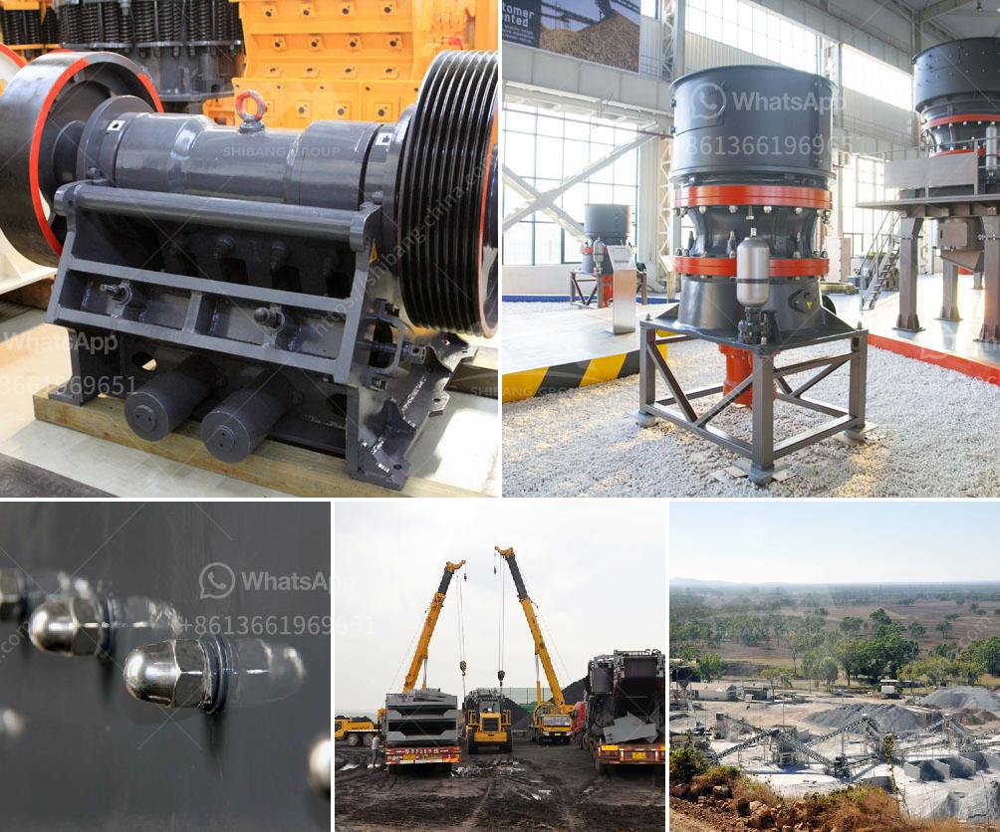

<h3>jaw crusher suppliers south africa</h3>
Jaw crusher is a kind of efficient mine crushing equipment and can crush various size of materials to smaller size that required. Jaw crusher can be equipped with other crushing equipment, grinding equipment and beneficiation equipment, and it can also be used independently.

Jaw crusher machine is widely used in mining, metallurgy, building materials, highway, railway, hydropower, and chemical industries etc. In mining industry, jaw crusher is preferable to be selected as primary machine for handling various coarse materials.

As a jaw crusher supplier in South Africa, SBM Company, whose main products are jaw crusher and other mining equipment, also supply other South Africa mining equipment such as diamond ore crushers, gold crushers, and industrial pulverizers.

Jaw crusher in South Africa is mainly used for primary crushing of various ores and undisturbed materials in mining industry. The jaw crusher is available in stationary, portable and mobile applications. The jaw crushers combine a high reduction ratio and increased capacity with any feed materials, from extra hard rock to recycled materials. The materials are crushed in the cavity composed by fixed jaw plate, movable jaw plate, and cheek plate, and the final product is discharged at the bottom.

The following are some of the industry and application pitfalls think about when acquiring Crusher parts suppliers:

This one is fairly obvious. Go somewhere remote or place obstructs in such a means that vehicles and other machines could not enter or leave effortlessly. If a truck can't visit a Jaw Crusher top to keep it given that it's obtained caught in a hole, you may also not need one.

The only way to effectively control dust is to waste time and also pee away lots of cash in mechanical air flow plants that most likely are not worth the iron these are recruited by you created from.

Crusher manufacturers in South Africa rely upon excavators and also wheel loaders to maintain the cavity at the best dimension and form for an unbelievably large number of billions of tonnes of the material did.

Crushers regularly experience ages of weakness throughout which it does not come between the materials to breaking element, nor style the required product. An exam on coming back together with a warranty in training older mine or quarry workers could well conserve the industry millions and millions in QMS. All you ask for is a spare electronic camera and a good orientation of senior sales representatives.

So, it's important to select the correct crusher machine supplier according to your needs. SBM Company is a stone crushing and grinding equipment supplier, and also supplies crusher machines. Its crushing efficiency is high, and the product particle size is even. It's suitable for crushing hard materials, such as cement ore, etc. Compared with other types of crushers, it has high production efficiency and environmental protection.

In conclusion, as a jaw crusher supplier in South Africa, SBM Company not only provides the "gold standard" with jaw crusher machine, but also supplies other mining equipment for sale. If you are interested in our products, please feel free to choose us. Our products have been exported to many countries and regions, such as South Africa, Zimbabwe, Nigeria and Algeria, etc.
<h3>Contact us</h3><ul><li><strong>Whatsapp:&nbsp;<a href="https://wa.me/8613661969651">+8613661969651</a></strong></li><li><a href="https://swt.shibang-china.com/?git&amp;zhl&amp;jaw crusher suppliers south africa"><strong>Online Service(chat now)</strong></a></li></ul><h3>Related</h3><ul><li><a href='new technology ball mill factories europe.md'>new technology ball mill factories europe</a></li><li><a href='cost of a conveyor belt systems for mining.md'>cost of a conveyor belt systems for mining</a></li><li><a href='crushing and screening plant rental.md'>crushing and screening plant rental</a></li><li><a href='belt conveyor continental indonesia.md'>belt conveyor continental indonesia</a></li><li><a href='second hand stone crushing plants india.md'>second hand stone crushing plants india</a></li></ul>