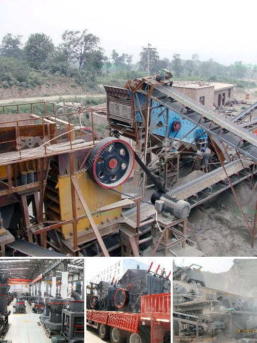

<h3>jaw crusher terminator</h3>
The jaw crusher Terminator, also known as TM Engineering Terminator, is a crusher that is widely used in the mining industry to crush different types of material. It is composed of a crushing chamber, a main shaft, an eccentric shaft, a flywheel, a toggle plate, a toggle bearing, and a adjusting device.

The Terminator crusher is amongst the most advanced and reliable in the market due to its high-quality steel structure, and its ability to generate a controlled and consistent discharge particle size. This makes it suitable for a variety of applications, including primary crushing in mining operations.

One of the key features of the Terminator crusher is its ability to adjust the crusher's closed side setting (CSS) with the use of a hydraulic toggle system. This enables operators to easily and accurately set the crusher to produce a specific product size, ensuring that the material meets the required specifications.

Another notable feature of the Terminator crusher is its strong and robust design, which allows it to withstand even the toughest working conditions. Its steel structure and heavy-duty components make it capable of handling large quantities of material without any compromise on performance or reliability.

The Terminator crusher is also equipped with an automatic lubrication system that ensures the crusher remains properly lubricated at all times. This not only extends the life of the crusher but also reduces maintenance and downtime, resulting in increased productivity and profitability for mining operations.

In addition to its advanced features, the Terminator crusher is also user-friendly and easy to operate. It is designed with safety in mind, with features such as a safety toggle plate, a safety shield, and an emergency stop button. This ensures that operators can work safely and efficiently, minimizing the risk of accidents.

Overall, the jaw crusher Terminator is a reliable and versatile crusher that is suitable for crushing a wide range of materials in various mining applications. Its high-quality construction, adjustable CSS, strong design, and user-friendly operation make it an ideal choice for mining companies looking to improve their crushing capabilities.

Whether it is used for primary crushing or as part of a secondary or tertiary crushing circuit, the Terminator crusher delivers consistent and accurate results, making it an essential tool for any mining operation. With its robust construction and advanced features, the Terminator crusher is a valuable asset for mining companies looking to maximize their productivity and profitability.
<h3>Contact us</h3><ul><li><strong>Whatsapp:&nbsp;<a href="https://wa.me/8613661969651">+8613661969651</a></strong></li><li><a href="https://swt.shibang-china.com/?git&amp;zhl&amp;jaw crusher terminator"><strong>Online Service(chat now)</strong></a></li></ul><h3>Related</h3><ul><li><a href='stone quarry machines in uganda for sale.md'>stone quarry machines in uganda for sale</a></li><li><a href='concrete stone crusher machine for sale in south africa.md'>concrete stone crusher machine for sale in south africa</a></li><li><a href='diesel grinding mills musina south africa.md'>diesel grinding mills musina south africa</a></li><li><a href='550 used cone crusher for sale.md'>550 used cone crusher for sale</a></li><li><a href='gravel jaw crusher.md'>gravel jaw crusher</a></li></ul>