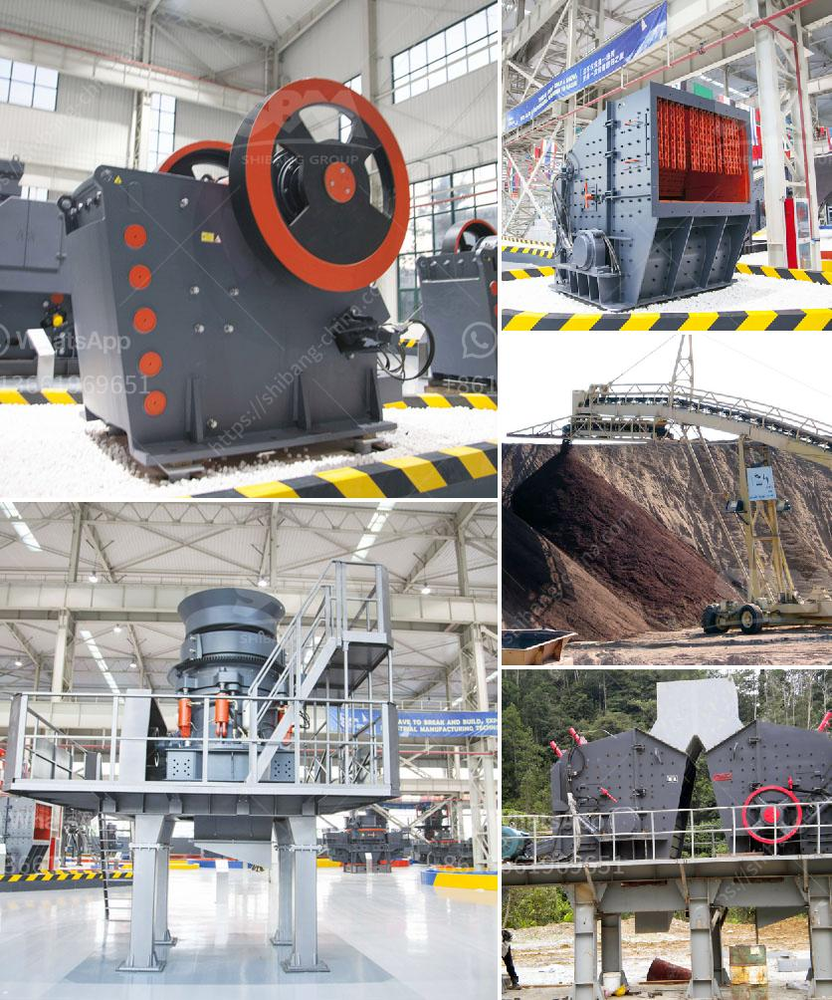

<h3>jaw crushers china</h3>
Industrial waste is no longer perceived as irrational or troubling, but as a potential resource that can be reused and catered to a variety of industries. The advent of efficient recycling systems, such as jaw crushers China, has created a new outlook on how construction waste can be utilized. These state-of-the-art machines are designed to expedite the process of crushing construction material and reclaim it for future use.

China has been leading the way in recycling construction waste, especially through the use of jaw crushers China. This sustainable practice has become common across construction sites throughout the country, as these machines can quickly convert waste into reusable materials. The jaw crusher, for instance, can process and crush large amounts of construction waste on-site, eliminating the need for additional handling and transport vehicles. This alone provides numerous benefits, such as reducing the carbon footprint and saving costs associated with transportation.

One of the primary advantages of using jaw crushers China is that they break down materials that are otherwise difficult to manage. For example, reinforced concrete, asphalt, and bricks are often discarded in landfills due to their resistance to decomposition. However, with the powerful jaws and hydraulic capabilities of a quality jaw crusher, these materials can be easily crushed into smaller, manageable sizes for reuse in new construction projects.

Furthermore, jaw crushers China often operate in conjunction with other machinery, such as excavators and loaders, to facilitate efficient waste management on construction sites. This combination allows for seamless coordination and increased productivity, as the crusher can continuously process the waste material while the excavators or loaders feed it with a steady supply. Consequently, the construction process becomes more streamlined, eliminating unnecessary waiting times and delays.

Another noteworthy feature of jaw crushers China is their versatility. These machines are capable of handling various types of construction waste, ranging from concrete and asphalt to rocks and stones. With adjustable jaws and different crushing modes, they can cater to the specific requirements of any project, ensuring that the resulting material adheres to the desired specifications. This versatility adds to their overall appeal and makes them even more suitable for a wide range of construction applications.

In addition to their functionality and convenience, jaw crushers China are also known for their durability and reliability. Equipped with exceptional hydraulic systems and wear-resistant materials, these machines are built to withstand heavy-duty usage without compromising their performance. This ensures that they deliver consistent results over extended periods, allowing construction companies to maximize their return on investment.

In conclusion, jaw crushers China have revolutionized the way construction waste is managed and utilized. These high-performing machines efficiently crush and process materials on-site, transforming them from potential environmental hazards to valuable resources. Their versatility, durability, and significant reduction in transportation requirements make them a perfect fit for sustainable construction practices. With the increasing emphasis on environmental conservation and resource conservation, jaw crushers China undoubtedly provide the perfect solution for reclaiming construction material.
<h3>Contact us</h3><ul><li><strong>Whatsapp:&nbsp;<a href="https://wa.me/8613661969651">+8613661969651</a></strong></li><li><a href="https://swt.shibang-china.com/?git&amp;zhl&amp;jaw crushers china"><strong>Online Service(chat now)</strong></a></li></ul><h3>Related</h3><ul><li><a href='30 x 42 portable jaw crusher for sale.md'>30 x 42 portable jaw crusher for sale</a></li><li><a href='mini concrete crusher portable for rent.md'>mini concrete crusher portable for rent</a></li><li><a href='gravel wash plant homemade.md'>gravel wash plant homemade</a></li><li><a href='crusher for quick limestone plant.md'>crusher for quick limestone plant</a></li><li><a href='mining equipment and hire zimbabwe.md'>mining equipment and hire zimbabwe</a></li></ul>