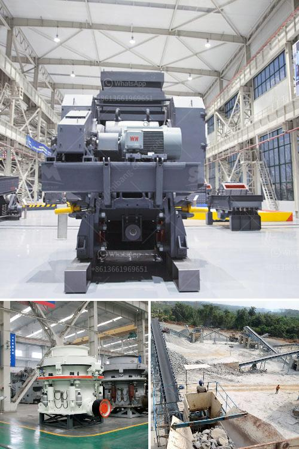

<h3>jaw crushers for sale in zimbabwe</h3>
Zimbabwe is a landlocked country located in southern Africa between the Zambezi and Limpopo rivers. It has a thriving mining industry which has been a key driver of economic growth in the country. With rich mineral resources such as gold, coal, nickel, platinum group metals, and diamonds, the mining industry has played a significant role in Zimbabwe's development.

When it comes to the extraction of minerals, jaw crushers have been widely used as primary crushers in mining operations. These robust machines are designed to handle the primary crushing duties in the mineral extraction process. They provide a reliable and efficient way to crush various rock and stone materials into smaller sizes, making them suitable for further processing.

In Zimbabwe, jaw crushers are often used as primary crushers due to their high crushing ratio and versatile design. They are utilized in various industries such as mining, quarrying, and recycling. Depending on the application, jaw crushers can be used in stationary, wheeled portable, or track-mounted configurations. For instance, in mining operations, a jaw crusher is often utilized in combination with cone crushers and vertical shaft impactors to produce high-quality aggregates for the construction industry.

One of the key advantages of jaw crushers is their ability to efficiently process large amounts of material. They can handle a wide range of feed sizes, from small pebbles to larger rocks, allowing operators to achieve the desired product size. Additionally, jaw crushers are known for their reliability, durability, and low operating costs, making them an excellent investment for mining companies operating in Zimbabwe.

When considering jaw crushers for sale in Zimbabwe, it is important to understand the different types available. There are two main categories of jaw crushers: single toggle and double toggle. Single toggle jaw crushers have one fixed jaw plate and one pivoted at the top, while double toggle jaw crushers have two fixed jaw plates and one pivoted at the top. Both types are widely used in the mining industry and each has its own advantages and disadvantages.

In addition to the type of jaw crusher, it is also important to consider other factors when selecting a crusher for sale in Zimbabwe. These include the capacity required, the feed size, the product size, the material hardness, and the available space. It is recommended to consult with a knowledgeable sales representative or a crusher manufacturer to determine the most suitable jaw crusher for specific mining requirements.

In conclusion, jaw crushers are essential equipment in the mining industry in Zimbabwe. They are versatile, reliable, and efficient, making them ideal for primary crushing in mineral extraction processes. When considering jaw crushers for sale, it is important to evaluate various factors such as the type of crusher, capacity, feed size, product size, and material hardness. By carefully selecting the appropriate jaw crusher, mining companies in Zimbabwe can maximize their productivity and optimize their operations.
<h3>Contact us</h3><ul><li><strong>Whatsapp:&nbsp;<a href="https://wa.me/8613661969651">+8613661969651</a></strong></li><li><a href="https://swt.shibang-china.com/?git&amp;zhl&amp;jaw crushers for sale in zimbabwe"><strong>Online Service(chat now)</strong></a></li></ul><h3>Related</h3><ul><li><a href='jaw crusher for sale in philippines.md'>jaw crusher for sale in philippines</a></li><li><a href='white cement manufacturing process pdf.md'>white cement manufacturing process pdf</a></li><li><a href='gypsum ceiling plant price in pakistan.md'>gypsum ceiling plant price in pakistan</a></li><li><a href='closed quarrz plants in kenya.md'>closed quarrz plants in kenya</a></li><li><a href='used stone crusher machine price.md'>used stone crusher machine price</a></li></ul>