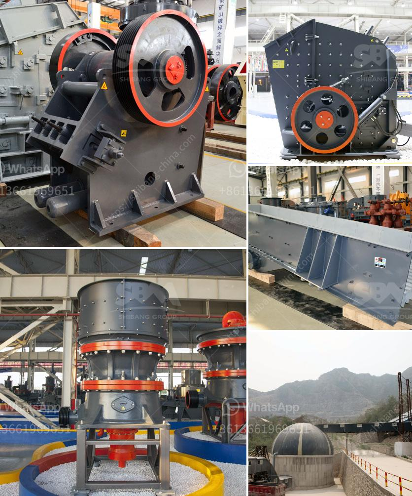

<h3>jaw crushers from saudi</h3>
Saudi Arabia is rich in minerals and abundant in oil resources. The exploration and production of these resources have transformed the country into a formidable force in the global market. Mining and construction activities in Saudi Arabia have increased significantly over the years. With the growing demand for high-quality aggregate, large-scale infrastructure projects, and an expanding mining sector, the need for jaw crushers is on the rise.

Jaw crushers are heavy-duty machines designed to efficiently crush hard rocks and minerals, even the toughest ones. These crushers have a unique crushing mechanism that enhances the performance and efficiency. Unlike traditional crushers, jaw crushers have a toggle plate made of a durable material. This toggle plate allows the moving jaw to move freely and attain a higher crushing capacity.

The increasing demand for high-quality aggregate in Saudi Arabia has led to an array of options for efficient and reliable crushing equipment. The selection of jaw crushers has proven to be an effective solution in the country's mining industry. Jaw crushers operate by squeezing rock between two surfaces, one of which opens and closes like a jaw. Rock enters the jaw crusher from the top, and pieces of rock that are larger than the opening at the bottom enter the jaw crusher, reducing them to smaller sizes.

The robustness and durability of jaw crushers make them ideal for processing minerals and hard rock materials. Additionally, jaw crushers are versatile machines that can be used for a variety of applications, such as quarrying, recycling, mining, and demolition projects. Their ability to handle both hard and soft materials makes them suitable for various operations in Saudi Arabia.

In conclusion, the demand for jaw crushers in Saudi Arabia has a promising future due to the country's vast mineral resources, infrastructure projects, and expanding mining sector. Jaw crushers are renowned for their heavy-duty construction and high-quality performance. These crushers are suitable for a wide range of applications, and their reliability and efficiency make them a valuable asset in the Saudi Arabian mining industry.
<h3>Contact us</h3><ul><li><strong>Whatsapp:&nbsp;<a href="https://wa.me/8613661969651">+8613661969651</a></strong></li><li><a href="https://swt.shibang-china.com/?git&amp;zhl&amp;jaw crushers from saudi"><strong>Online Service(chat now)</strong></a></li></ul><h3>Related</h3><ul><li><a href='jual stone crusher philippines.md'>jual stone crusher philippines</a></li><li><a href='crusher equipment oman in muscat oman.md'>crusher equipment oman in muscat oman</a></li><li><a href='limestone powder manufacture machine.md'>limestone powder manufacture machine</a></li><li><a href='cement plant cost estimation cement plant cost.md'>cement plant cost estimation cement plant cost</a></li><li><a href='hydrated lime plant machinery manufacturer.md'>hydrated lime plant machinery manufacturer</a></li></ul>